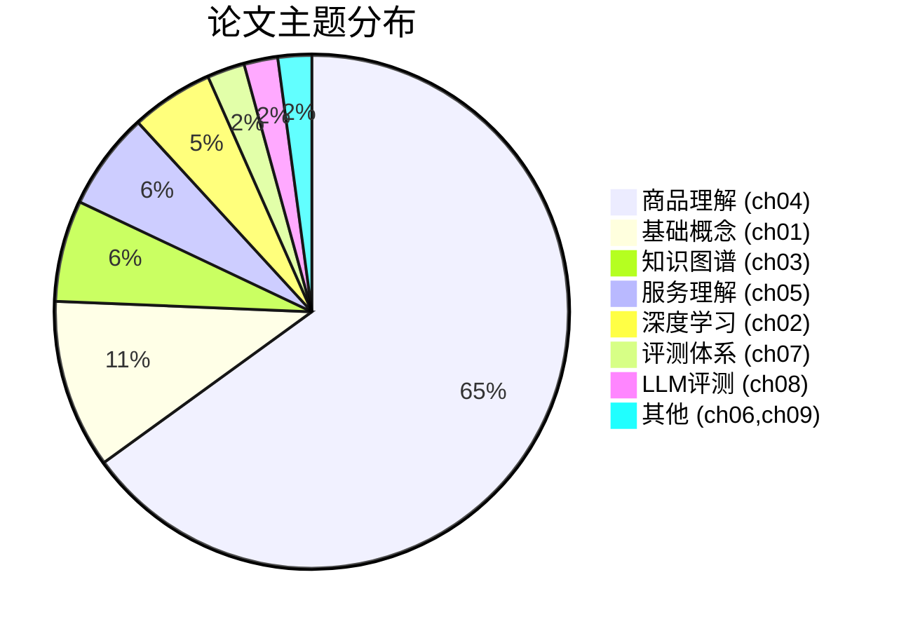

# 图1.3：423篇论文研究领域分布

## 各目录论文数量统计

| 目录 | 论文数量 | 主要研究方向 |
|------|---------|-------------|
| product_matching | 201篇 | 商品表示、匹配、检索 |
| ecommerce_evaluation | 123篇 | 电商评测、推荐系统 |
| mini_program_service | 100篇 | 服务理解、对话系统 |

## 论文主题分类（按章节）

## 核心技术论文引用排行榜（基于文件名频率）

| 技术方向 | 论文数量 | 示例文件名 |
|---------|---------|-----------|
| BERT相关 | 8+ | 1901.04085, 1904.07531, 2010.06467 |
| GNN相关 | 5+ | 1902.07243, 2105.05881 |
| 知识图谱 | 6+ | 1911.12481, 2002.11143, 2009.11684 |
| 推荐系统 | 15+ | 1708.05031, 1803.00710, 1905.09248 |
| 分类技术 | 4+ | 1812.05774, 1903.04254 |
