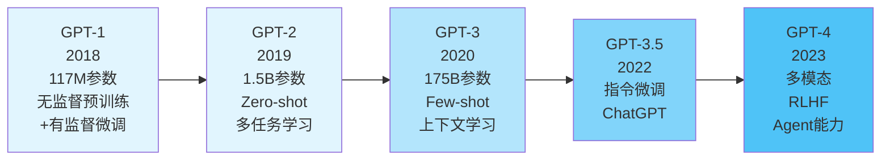

# 图2.4：GPT系列演进

```mermaid
graph LR
    GPT1[GPT-1<br/>2018<br/>117M参数<br/>无监督预训练<br/>+有监督微调] --> GPT2[GPT-2<br/>2019<br/>1.5B参数<br/>Zero-shot<br/>多任务学习]
    GPT2 --> GPT3[GPT-3<br/>2020<br/>175B参数<br/>Few-shot<br/>上下文学习]
    GPT3 --> GPT3.5[GPT-3.5<br/>2022<br/+RLHF<br/>指令微调<br/>ChatGPT]
    GPT3.5 --> GPT4[GPT-4<br/>2023<br/>多模态<br/>RLHF<br/>Agent能力]
    
    style GPT1 fill:#e1f5fe
    style GPT2 fill:#e1f5fe
    style GPT3 fill:#b3e5fc
    style GPT3.5 fill:#81d4fa
    style GPT4 fill:#4fc3f7
```

标题: GPT系列演进
说明: 展示GPT系列模型从2018年到2023年的发展历程，参数规模从117M增长到超大规模
