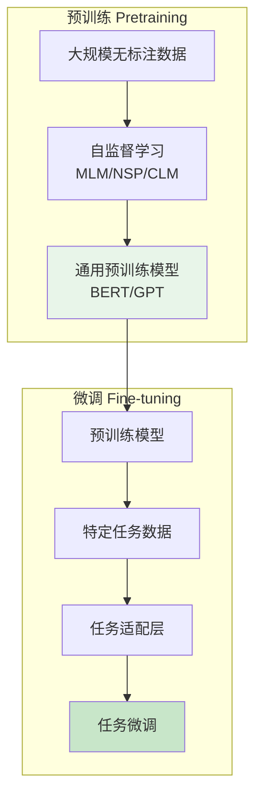

# 图2.5：预训练 vs 微调对比

```mermaid
graph TD
    subgraph "预训练 Pretraining"
        P1[大规模无标注数据] --> P2[自监督学习<br/>MLM/NSP/CLM]
        P2 --> P3[通用预训练模型<br/>BERT/GPT]
    end
    
    subgraph "微调 Fine-tuning"
        F1[预训练模型] --> F2[特定任务数据]
        F2 --> F3[任务适配层]
        F3 --> F4[任务微调]
    end
    
    P3 --> F1
    
    style P3 fill:#e8f5e9
    style F4 fill:#c8e6c9
```

标题: 预训练 vs 微调对比
说明: 展示预训练阶段和微调阶段的流程对比，预训练学习通用表示，微调适配下游任务
