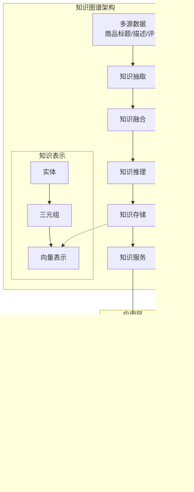

# 图3.1：知识图谱架构图

```mermaid
graph TD
    subgraph "知识图谱架构"
        Data[多源数据<br/>商品标题/描述/评论] --> Extract[知识抽取]
        Extract --> Fusion[知识融合]
        Fusion --> Reasoning[知识推理]
        Reasoning --> Store[知识存储]
        Store --> Service[知识服务]
        
        subgraph "知识表示"
            Entity[实体] --> Triple[三元组]
            Triple --> Embedding[向量表示]
        end
        
        Store -.-> Embedding
    end
    
    subgraph "应用层"
        Search[搜索] --> Rec[推荐]
        Rec --> QA[问答]
        QA --> Anal[分析]
    end
    
    Service --> Search
```

标题: 知识图谱架构图
说明: 展示知识图谱的完整架构，包括数据源、知识抽取、融合、推理、存储和服务层
