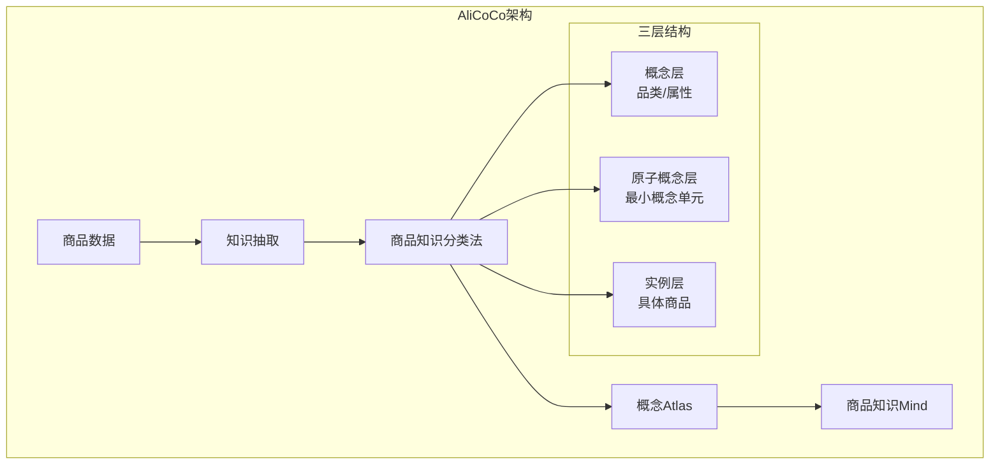

# 图3.3：AliCoCo体系结构图

```mermaid
graph TD
    subgraph "AliCoCo架构"
        Data[商品数据] --> Extract[知识抽取]
        Extract --> Taxonomy[商品知识分类法]
        Taxonomy --> Atlas[概念Atlas]
        Atlas --> Mind[商品知识Mind]
        
        subgraph "三层结构"
            Tax1[概念层<br/>品类/属性] 
            Tax2[原子概念层<br/>最小概念单元]
            Tax3[实例层<br/>具体商品]
        end
        
        Taxonomy --> Tax1
        Taxonomy --> Tax2
        Taxonomy --> Tax3
    end
```

标题: AliCoCo体系结构图
说明: 展示阿里巴巴商品知识图谱AliCoCo的三层架构：概念层、原子概念层和实例层
