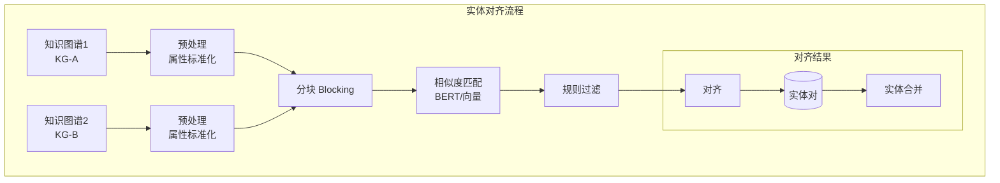

# 图3.4：实体对齐流程图

```mermaid
graph TD
    subgraph "实体对齐流程"
        KG1[知识图谱1<br/>KG-A] --> Pre1[预处理<br/>属性标准化]
        KG2[知识图谱2<br/>KG-B] --> Pre2[预处理<br/>属性标准化]
        
        Pre1 --> Block[分块 Blocking]
        Pre2 --> Block
        
        Block --> Match[相似度匹配<br/>BERT/向量]
        Match --> Rule[规则过滤]
        Rule --> Align[对齐]
        
        subgraph "对齐结果"
            Align --> Result[(实体对)]
            Result --> Merge[实体合并]
        end
    end
```

标题: 实体对齐流程图
说明: 展示跨知识图谱实体对齐的完整流程，包括预处理、分块、相似度匹配和实体合并
