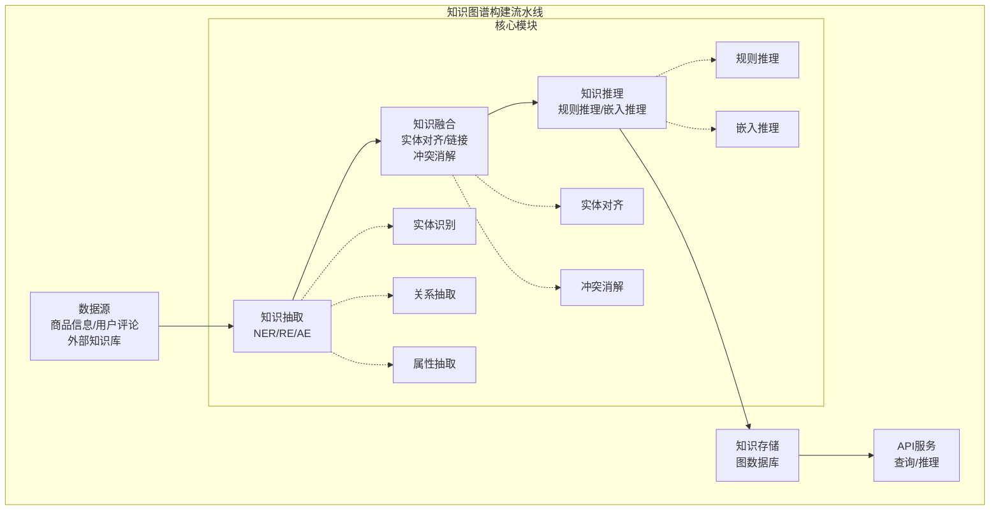

# 图3.5：知识图谱构建流水线

```mermaid
graph TD
    subgraph "知识图谱构建流水线"
        Source[数据源<br/>商品信息/用户评论<br/>外部知识库] --> Extract[知识抽取<br/>NER/RE/AE]
        
        Extract --> Fusion[知识融合<br/>实体对齐/链接<br/>冲突消解]
        
        Fusion --> Infer[知识推理<br/>规则推理/嵌入推理]
        
        Infer --> Storage[知识存储<br/>图数据库]
        
        Storage --> API[API服务<br/>查询/推理]
        
        subgraph "核心模块"
            Extract -.-> E1[实体识别]
            Extract -.-> E2[关系抽取]
            Extract -.-> E3[属性抽取]
            
            Fusion -.-> F1[实体对齐]
            Fusion -.-> F2[冲突消解]
            
            Infer -.-> I1[规则推理]
            Infer -.-> I2[嵌入推理]
        end
    end
```

标题: 知识图谱构建流水线
说明: 展示知识图谱从数据源到API服务的完整构建流水线，包括抽取、融合、推理和存储
