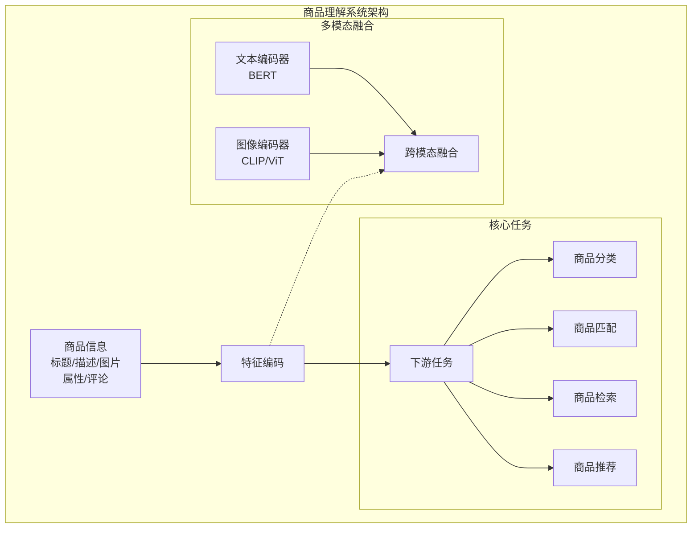

# 图4.1：商品理解系统架构

```mermaid
graph TD
    subgraph "商品理解系统架构"
        Input[商品信息<br/>标题/描述/图片<br/>属性/评论] --> Encode[特征编码]
        
        Encode --> Tasks[下游任务]
        
        subgraph "多模态融合"
            TextEnc[文本编码器<br/>BERT]
            ImageEnc[图像编码器<br/>CLIP/ViT]
            Fuse[跨模态融合]
            
            TextEnc --> Fuse
            ImageEnc --> Fuse
        end
        
        Encode -.-> Fuse
        
        subgraph "核心任务"
            Tasks --> Class[商品分类]
            Tasks --> Match[商品匹配]
            Tasks --> Retrieve[商品检索]
            Tasks --> Recommend[商品推荐]
        end
    end
```

标题: 商品理解系统架构
说明: 展示商品理解系统的完整架构，包括多模态特征编码和下游任务
