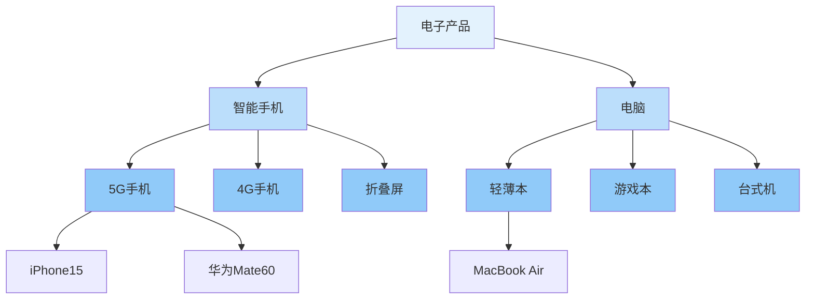

# 图4.2：商品分类层次结构

```mermaid
graph TD
    Root[电子产品] --> Cat1[智能手机]
    Root --> Cat2[电脑]
    
    Cat1 --> Sub1[5G手机]
    Cat1 --> Sub2[4G手机]
    Cat1 --> Sub3[折叠屏]
    
    Cat2 --> Sub4[轻薄本]
    Cat2 --> Sub5[游戏本]
    Cat2 --> Sub6[台式机]
    
    Sub1 --> Leaf1[iPhone15]
    Sub1 --> Leaf2[华为Mate60]
    Sub4 --> Leaf3[MacBook Air]
    
    style Root fill:#e3f2fd
    style Cat1 fill:#bbdefb
    style Cat2 fill:#bbdefb
    style Sub1 fill:#90caf9
    style Sub2 fill:#90caf9
    style Sub3 fill:#90caf9
    style Sub4 fill:#90caf9
    style Sub5 fill:#90caf9
    style Sub6 fill:#90caf9
```

标题: 商品分类层次结构
说明: 展示电商商品的层次化分类体系，从根类目到叶子类目
