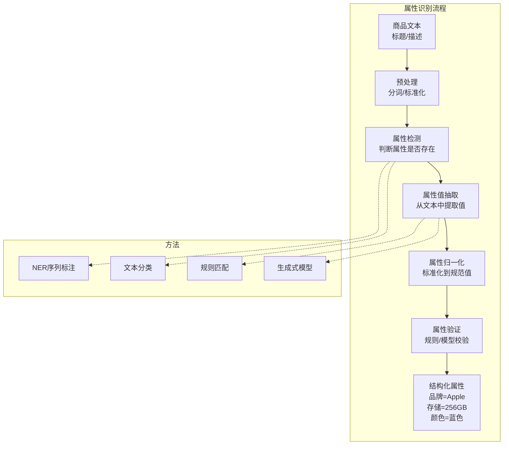

# 图4.3：属性识别流程图

```mermaid
graph TD
    subgraph "属性识别流程"
        Input[商品文本<br/>标题/描述] --> Preprocess[预处理<br/>分词/标准化]
        
        Preprocess --> Detect[属性检测<br/>判断属性是否存在]
        
        Detect --> Extract[属性值抽取<br/>从文本中提取值]
        
        Extract --> Norm[属性归一化<br/>标准化到规范值]
        
        Norm --> Verify[属性验证<br/>规则/模型校验]
        
        Verify --> Output[结构化属性<br/>品牌=Apple<br/>存储=256GB<br/>颜色=蓝色]
    end
    
    subgraph "方法"
        Detect -.-> D1[NER序列标注]
        Detect -.-> D2[文本分类]
        Extract -.-> E1[规则匹配]
        Extract -.-> E2[生成式模型]
    end
```

标题: 属性识别流程图
说明: 展示商品属性识别的完整流程，包括属性检测、值抽取、归一化和验证
