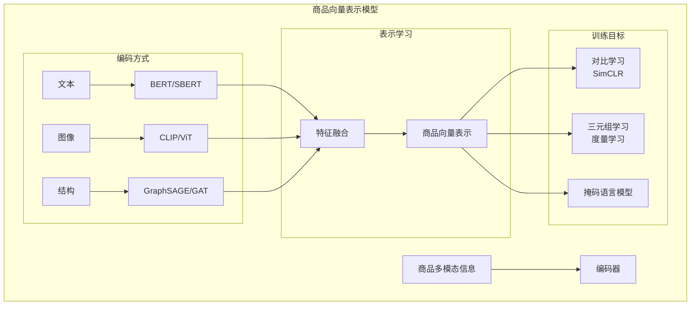

# 图4.4：商品向量表示模型

```mermaid
graph TD
    subgraph "商品向量表示模型"
        Input[商品多模态信息] --> Encode[编码器]
        
        subgraph "编码方式"
            Text[文本] --> TextEnc[BERT/SBERT]
            Image[图像] --> ImageEnc[CLIP/ViT]
            Graph[结构] --> GraphEnc[GraphSAGE/GAT]
        end
        
        subgraph "表示学习"
            TextEnc --> Fusion[特征融合]
            ImageEnc --> Fusion
            GraphEnc --> Fusion
            
            Fusion --> Rep[商品向量表示]
        end
        
        subgraph "训练目标"
            Rep --> Sim[对比学习<br/>SimCLR]
            Rep --> Triplet[三元组学习<br/>度量学习]
            Rep --> MLM[掩码语言模型]
        end
    end
```

标题: 商品向量表示模型
说明: 展示商品多模态向量表示的学习方法，包括文本、图像、图结构编码和多种训练目标
