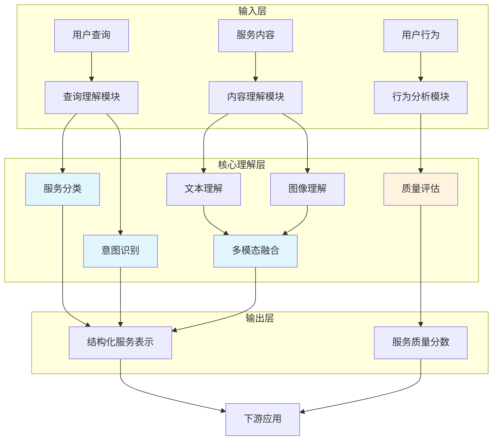

# 第5章：服务理解与知识图谱

## 图表索引

| 图表编号 | 文件名 | 标题 | 说明 |
|---------|--------|------|------|
| 图5.1 | chapter_05_fig1_service_understanding_mermaid.md | 服务理解系统架构 | 展示小程序服务理解的完整技术架构，包括服务分类、意图理解、内容理解、质量评估等模块 |
| 图5.2 | chapter_05_fig2_service_taxonomy_mermaid.md | 服务分类层次体系 | 展示小程序服务的多维度分类体系，按性质、行业、需求三个维度组织 |
| 图5.3 | chapter_05_fig3_intent_slot_mermaid.md | 意图识别与槽位填充流程 | 展示从用户查询到意图理解和槽位填充的完整处理流程 |
| 图5.4 | chapter_05_fig4_service_kg_mermaid.md | 服务知识图谱结构 | 展示服务知识图谱的核心实体类型和关系类型 |
| 图5.5 | chapter_05_fig5_quality_assessment_mermaid.md | 服务质量评估框架 | 展示服务质量多维评估的指标体系和评估方法 |

## 图5.1：服务理解系统架构

