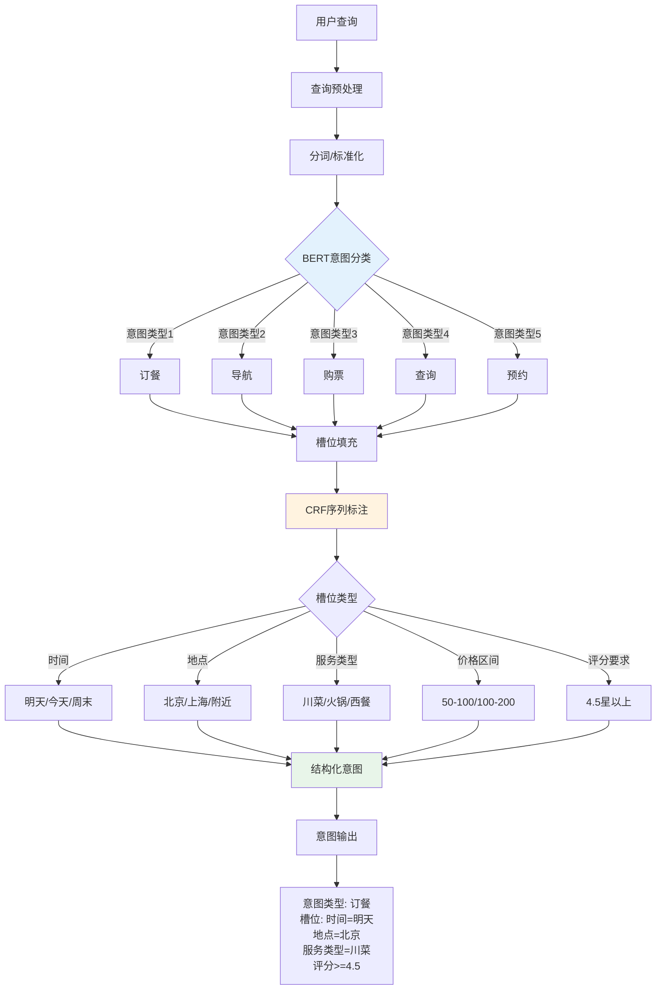

```mermaid
flowchart TD
    A[用户查询] --> B[查询预处理]
    B --> C[分词/标准化]
    C --> D{BERT意图分类}
    D -->|意图类型1| E1[订餐]
    D -->|意图类型2| E2[导航]
    D -->|意图类型3| E3[购票]
    D -->|意图类型4| E4[查询]
    D -->|意图类型5| E5[预约]
    
    E1 --> F1[槽位填充]
    E2 --> F1
    E3 --> F1
    E4 --> F1
    E5 --> F1
    
    F1 --> G[CRF序列标注]
    
    G --> H{槽位类型}
    H -->|时间| I1[明天/今天/周末]
    H -->|地点| I2[北京/上海/附近]
    H -->|服务类型| I3[川菜/火锅/西餐]
    H -->|价格区间| I4[50-100/100-200]
    H -->|评分要求| I5[4.5星以上]
    
    I1 --> J[结构化意图]
    I2 --> J
    I3 --> J
    I4 --> J
    I5 --> J
    
    J --> K[意图输出]
    K --> L[意图类型: 订餐<br/>槽位: 时间=明天<br/>地点=北京<br/>服务类型=川菜<br/>评分>=4.5]
    
    style D fill:#e3f2fd
    style G fill:#fff3e0
    style J fill:#e8f5e9
```
