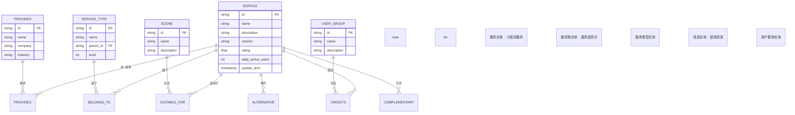

```mermaid
erDiagram
    SERVICE ||--o{ PROVIDES : "由~提供"
    SERVICE ||--o{ BELONGS_TO : "属于"
    SERVICE ||--o{ SUITABLE_FOR : "适用于"
    SERVICE ||--o{ TARGETS : "面向"
    SERVICE ||--o{ ALTERNATIVE : "替代"
    SERVICE ||--o{ COMPLEMENTARY : "互补"
    PROVIDER ||--o{ PROVIDES : "提供"
    SERVICE_TYPE ||--o{ BELONGS_TO : "属于"
    SCENE ||--o{ SUITABLE_FOR : "包含"
    USER_GROUP ||--o{ TARGETS : "包含"
    
    SERVICE {
        string id PK
        string name
        string description
        string version
        float rating
        int daily_active_users
        timestamp update_time
    }
    
    PROVIDER {
        string id PK
        string name
        string company
        string industry
    }
    
    SERVICE_TYPE {
        string id PK
        string name
        string parent_id FK
        int level
    }
    
    SCENE {
        string id PK
        string name
        string description
    }
    
    USER_GROUP {
        string id PK
        string name
        string description
    }

    note for SERVICE "服务实体：小程序服务"
    note for PROVIDER "服务商实体：服务提供方"
    note for SERVICE_TYPE "服务类型实体"
    note for SCENE "场景实体：使用场景"
    note for USER_GROUP "用户群体实体"
```
