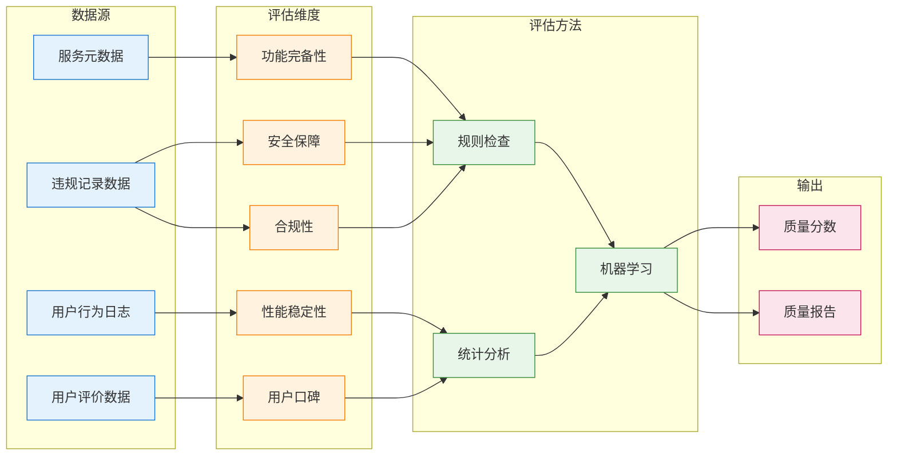

```mermaid
flowchart LR
    subgraph 数据源
        A[服务元数据]
        B[用户行为日志]
        C[用户评价数据]
        D[违规记录数据]
    end
    
    subgraph 评估维度
        E[功能完备性]
        F[性能稳定性]
        G[用户口碑]
        H[安全保障]
        I[合规性]
    end
    
    subgraph 评估方法
        J[规则检查]
        K[统计分析]
        L[机器学习]
    end
    
    subgraph 输出
        M[质量分数]
        N[质量报告]
    end
    
    A --> E
    B --> F
    C --> G
    D --> H
    D --> I
    
    E --> J
    F --> K
    G --> K
    H --> J
    I --> J
    
    J --> L
    K --> L
    
    L --> M
    L --> N
    
    style A fill:#e3f2fd,stroke:#1976d2
    style B fill:#e3f2fd,stroke:#1976d2
    style C fill:#e3f2fd,stroke:#1976d2
    style D fill:#e3f2fd,stroke:#1976d2
    style E fill:#fff3e0,stroke:#f57c00
    style F fill:#fff3e0,stroke:#f57c00
    style G fill:#fff3e0,stroke:#f57c00
    style H fill:#fff3e0,stroke:#f57c00
    style I fill:#fff3e0,stroke:#f57c00
    style J fill:#e8f5e9,stroke:#388e3c
    style K fill:#e8f5e9,stroke:#388e3c
    style L fill:#e8f5e9,stroke:#388e3c
    style M fill:#fce4ec,stroke:#c2185b
    style N fill:#fce4ec,stroke:#c2185b
```
