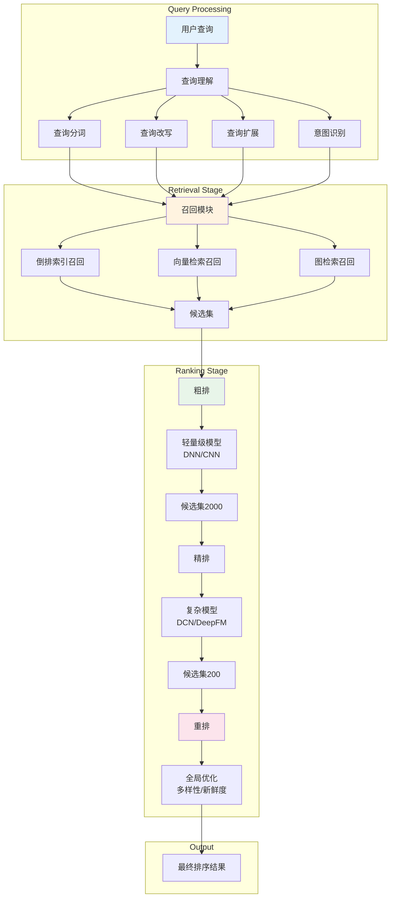

```mermaid
flowchart TB
    subgraph "Query Processing"
        A[用户查询] --> B[查询理解]
        B --> C[查询分词]
        B --> D[查询改写]
        B --> E[查询扩展]
        B --> F[意图识别]
    end
    
    subgraph "Retrieval Stage"
        C --> G[召回模块]
        D --> G
        E --> G
        F --> G
        
        G --> H[倒排索引召回]
        G --> I[向量检索召回]
        G --> J[图检索召回]
        
        H --> K[候选集]
        I --> K
        J --> K
    end
    
    subgraph "Ranking Stage"
        K --> L[粗排]
        L --> M[轻量级模型<br/>DNN/CNN]
        M --> N[候选集2000]
        
        N --> O[精排]
        O --> P[复杂模型<br/>DCN/DeepFM]
        P --> Q[候选集200]
        
        Q --> R[重排]
        R --> S[全局优化<br/>多样性/新鲜度]
    end
    
    subgraph "Output"
        S --> T[最终排序结果]
    end
    
    style A fill:#e3f2fd
    style G fill:#fff3e0
    style L fill:#e8f5e9
    style R fill:#fce4ec
```
