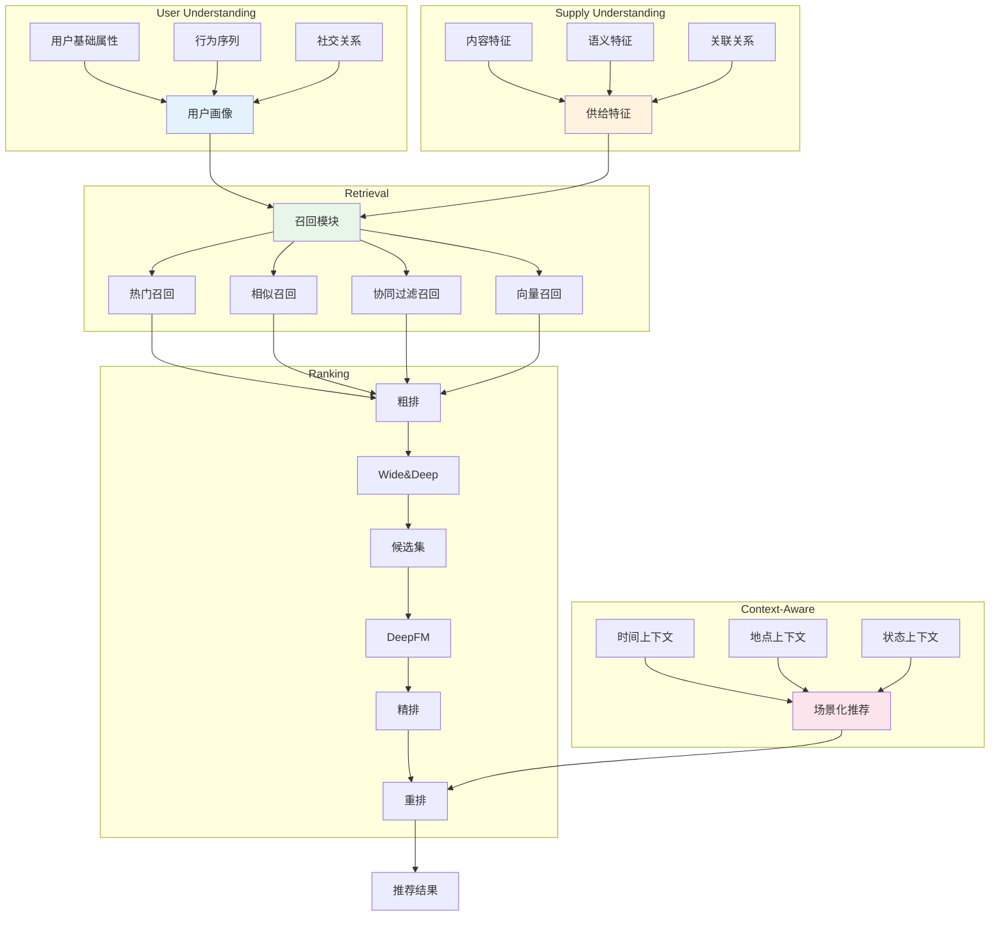

```mermaid
flowchart TB
    subgraph "User Understanding"
        A[用户基础属性] --> D[用户画像]
        B[行为序列] --> D
        C[社交关系] --> D
    end
    
    subgraph "Supply Understanding"
        E[内容特征] --> H[供给特征]
        F[语义特征] --> H
        G[关联关系] --> H
    end
    
    subgraph "Retrieval"
        D --> I[召回模块]
        H --> I
        I --> J[热门召回]
        I --> K[相似召回]
        I --> L[协同过滤召回]
        I --> M[向量召回]
    end
    
    subgraph "Ranking"
        J --> N[粗排]
        K --> N
        L --> N
        M --> N
        N --> O[Wide&Deep]
        O --> P[候选集]
        P --> Q[DeepFM]
        Q --> R[精排]
        R --> S[重排]
    end
    
    subgraph "Context-Aware"
        T[时间上下文] --> U[场景化推荐]
        V[地点上下文] --> U
        W[状态上下文] --> U
        U --> S
    end
    
    S --> X[推荐结果]
    
    style D fill:#e3f2fd
    style H fill:#fff3e0
    style I fill:#e8f5e9
    style U fill:#fce4ec
```
