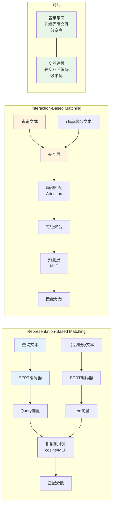

```mermaid
graph LR
    subgraph "Representation-Based Matching"
        A[查询文本] --> B[BERT编码器]
        C[商品/服务文本] --> D[BERT编码器]
        B --> E[Query向量]
        D --> F[Item向量]
        E --> G[相似度计算<br/>cosine/MLP]
        F --> G
        G --> H[匹配分数]
    end
    
    subgraph "Interaction-Based Matching"
        I[查询文本] --> J[交互层]
        K[商品/服务文本] --> J
        J --> L[局部匹配<br/>Attention]
        L --> M[特征聚合]
        M --> N[预测层<br/>MLP]
        N --> O[匹配分数]
    end
    
    subgraph "对比"
        P[表示学习<br/>先编码后交互<br/>效率高] --- Q[交互建模<br/>先交互后编码<br/>效果优]
    end
    
    style A fill:#e3f2fd
    style B fill:#e3f2fd
    style I fill:#fff3e0
    style J fill:#fff3e0
    style P fill:#e8f5e9
    style Q fill:#e8f5e9
```
