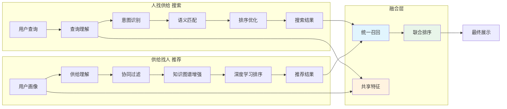

```mermaid
flowchart LR
    subgraph "人找供给 搜索"
        A[用户查询] --> B[查询理解]
        B --> C[意图识别]
        C --> D[语义匹配]
        D --> E[排序优化]
        E --> F[搜索结果]
    end
    
    subgraph "供给找人 推荐"
        G[用户画像] --> H[供给理解]
        H --> I[协同过滤]
        I --> J[知识图谱增强]
        J --> K[深度学习排序]
        K --> L[推荐结果]
    end
    
    subgraph "融合层"
        M[统一召回]
        N[共享特征]
        O[联合排序]
    end
    
    F --> M
    L --> M
    B --> N
    G --> N
    M --> O
    O --> P[最终展示]
    
    style M fill:#e1f5fe
    style N fill:#fff3e0
    style O fill:#e8f5e9
```
