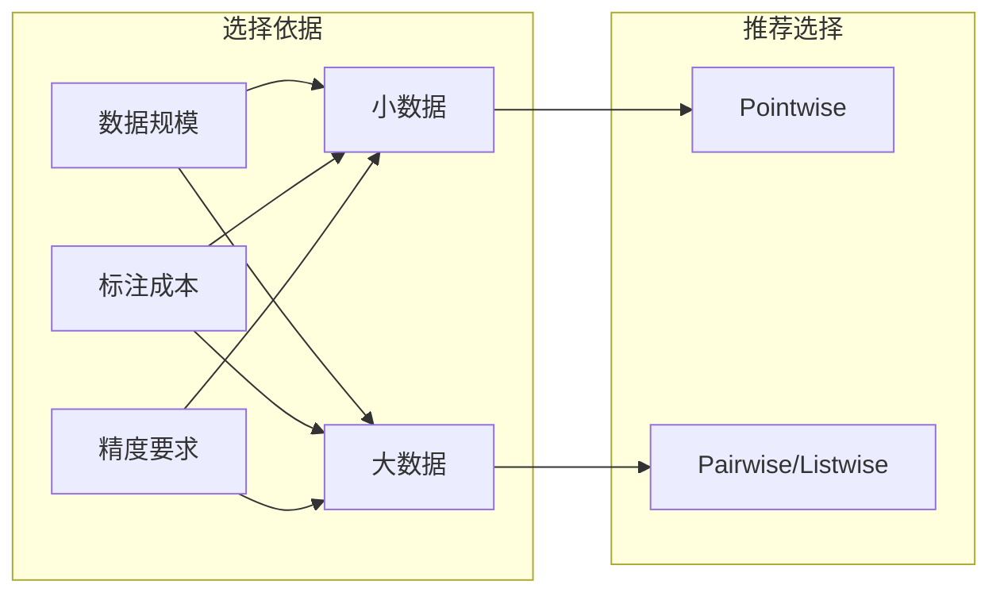
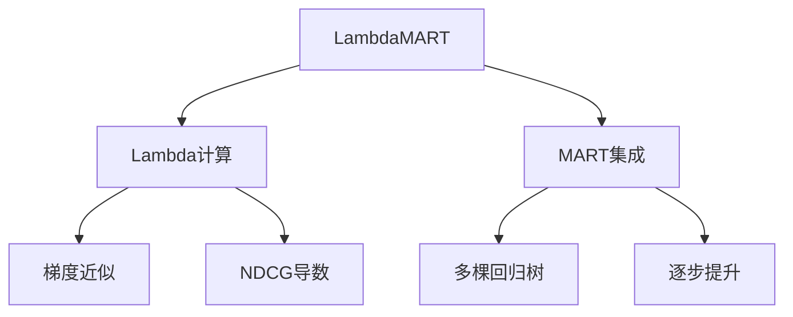
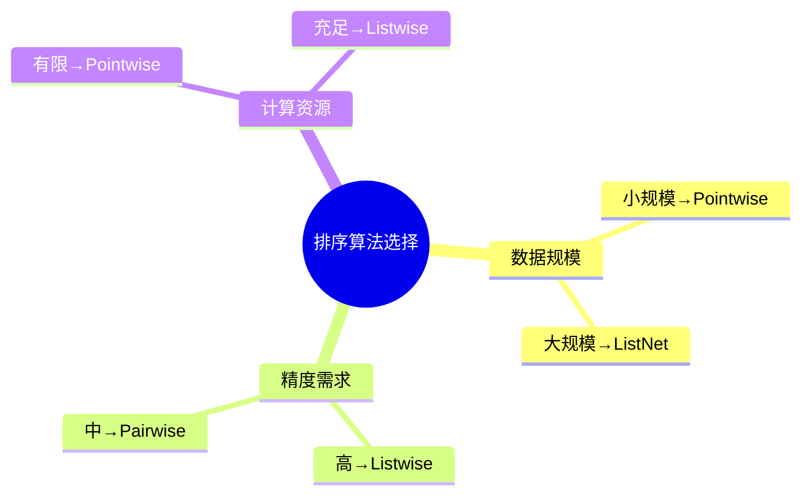

# 图7.10：排序学习算法对比与选择

## 算法对比矩阵

```mermaid
flowchart LR
    subgraph 选择依据
        A[数据规模] --> D[小数据]
        A --> E[大数据]
        B[标注成本] --> D
        B --> E
        C[精度要求] --> D
        C --> E
    end
    
    subgraph 推荐选择
        D --> G[Pointwise]
        E --> H[Pairwise/Listwise]
    end
```

## LambdaMART算法

```mermaid
flowchart TD
    A[LambdaMART] --> B[Lambda计算]
    A --> C[MART集成]
    
    B --> B1[梯度近似]
    B --> B2[NDCG导数]
    
    C --> C1[多棵回归树]
    C --> C2[逐步提升]
```

## 实践建议

```mermaid
mindmap
  root((排序算法选择))
    数据规模
      小规模→Pointwise
      大规模→ListNet
    精度需求
      高→Listwise
      中→Pairwise
    计算资源
      有限→Pointwise
      充足→Listwise
```
