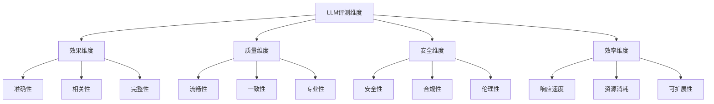
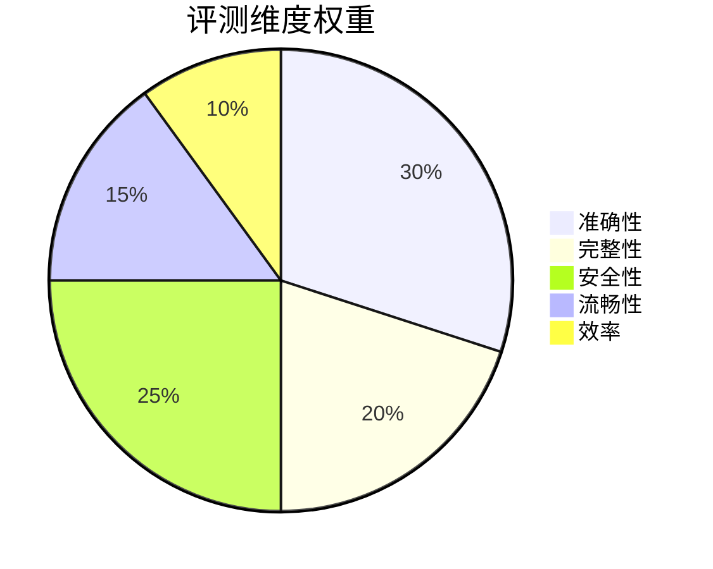

# 图7.11：评测维度分解——多维度评估框架

## 评测维度体系

```mermaid
flowchart TD
    A[LLM评测维度] --> B[效果维度]
    A --> C[质量维度]
    A --> D[安全维度]
    A --> E[效率维度]
    
    B --> B1[准确性]
    B --> B2[相关性]
    B --> B3[完整性]
    
    C --> C1[流畅性]
    C --> C2[一致性]
    C --> C3[专业性]
    
    D --> D1[安全性]
    D --> D2[合规性]
    D --> D3[伦理性]
    
    E --> E1[响应速度]
    E --> E2[资源消耗]
    E --> E3[可扩展性]
```

## 维度权重配置

```mermaid
pie title 评测维度权重
    "准确性" : 30
    "完整性" : 20
    "安全性" : 25
    "流畅性" : 15
    "效率" : 10
```
