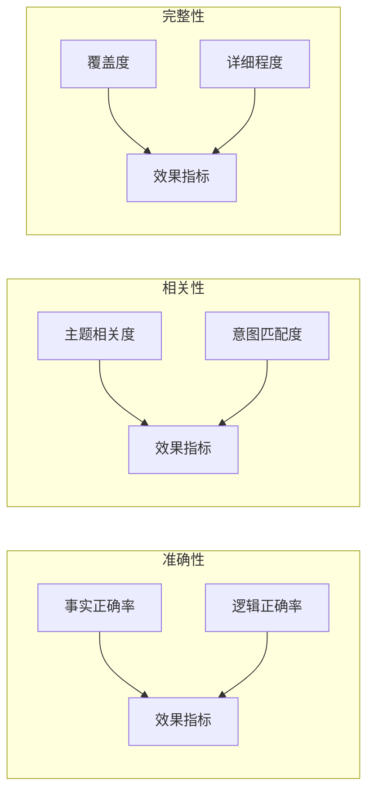
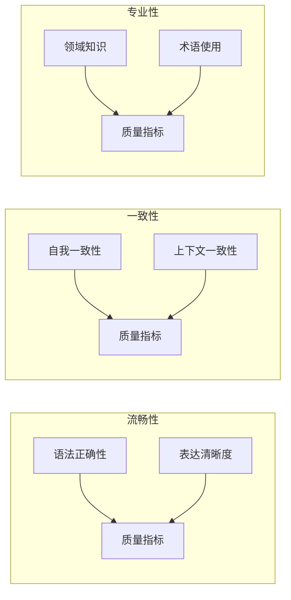

# 图7.12：各维度核心指标

## 效果维度指标

```mermaid
flowchart LR
    subgraph 准确性
        A1[事实正确率] --> A4[效果指标]
        A2[逻辑正确率] --> A4
    end
    
    subgraph 相关性
        B1[主题相关度] --> B4[效果指标]
        B2[意图匹配度] --> B4
    end
    
    subgraph 完整性
        C1[覆盖度] --> C4[效果指标]
        C2[详细程度] --> C4
    end
```

## 质量维度指标

```mermaid
flowchart LR
    subgraph 流畅性
        A1[语法正确性] --> A4[质量指标]
        A2[表达清晰度] --> A4
    end
    
    subgraph 一致性
        B1[自我一致性] --> B4[质量指标]
        B2[上下文一致性] --> B4
    end
    
    subgraph 专业性
        C1[领域知识] --> C4[质量指标]
        C2[术语使用] --> C4
    end
```
