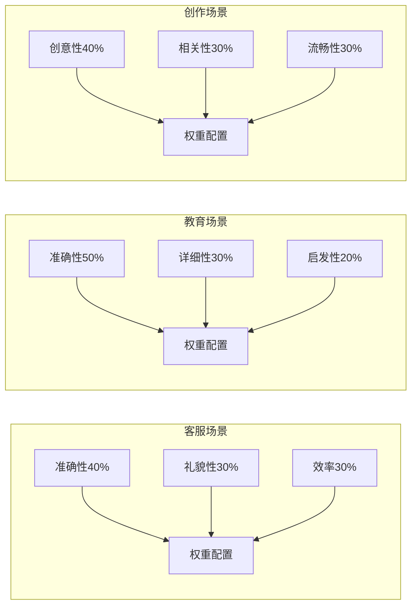
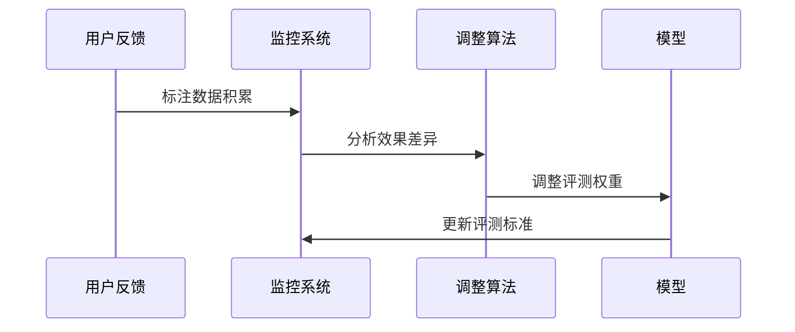

# 图7.13：维度权重动态调整

## 场景化权重

```mermaid
flowchart LR
    subgraph 客服场景
        A1[准确性40%] --> A4[权重配置]
        A2[礼貌性30%] --> A4
        A3[效率30%] --> A4
    end
    
    subgraph 教育场景
        B1[准确性50%] --> B4[权重配置]
        B2[详细性30%] --> B4
        B3[启发性20%] --> B4
    end
    
    subgraph 创作场景
        C1[创意性40%] --> C4[权重配置]
        C2[相关性30%] --> C4
        C3[流畅性30%] --> C4
    end
```

## 动态调整机制

```mermaid
sequenceDiagram
    participant U as 用户反馈
    participant S as 监控系统
    participant A as 调整算法
    participant M as 模型
    
    U->>S: 标注数据积累
    S->>A: 分析效果差异
    A->>M: 调整评测权重
    M->>S: 更新评测标准
```
