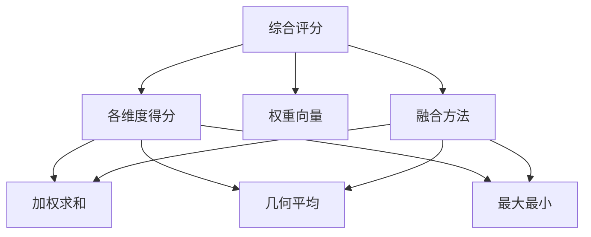

# 图7.14：多维度综合评分方法

## 综合评分计算



## 评分可视化

```mermaid
radarChart
    title 多维度评分雷达图
    axes: 准确性, 完整性, 相关性, 流畅性, 安全性
    数据A: [0.9, 0.8, 0.85, 0.7, 0.95]
    数据B: [0.85, 0.85, 0.8, 0.8, 0.9]
    数据C: [0.8, 0.9, 0.75, 0.85, 0.85]
```
