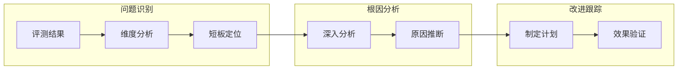
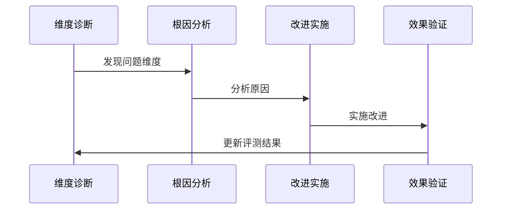

# 图7.15：维度诊断与改进追踪

## 诊断分析框架

```mermaid
flowchart LR
    subgraph 问题识别
        A[评测结果] --> D[维度分析]
        D --> E[短板定位]
    end
    
    subgraph 根因分析
        E --> F[深入分析]
        F --> G[原因推断]
    end
    
    subgraph 改进跟踪
        G --> H[制定计划]
        H --> I[效果验证]
    end
```

## 改进追踪流程

```mermaid
sequenceDiagram
    participant D as 维度诊断
    participant R as 根因分析
    participant I as 改进实施
    participant V as 效果验证
    
    D->>R: 发现问题维度
    R->>I: 分析原因
    I->>V: 实施改进
    V->>D: 更新评测结果
```
