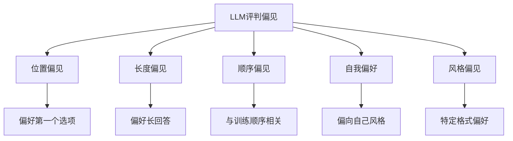
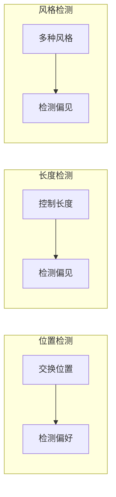

# 图7.16：偏见检测——识别LLM评判中的偏见

## 常见偏见类型

```mermaid
flowchart TD
    A[LLM评判偏见] --> B[位置偏见]
    A --> C[长度偏见]
    A --> D[顺序偏见]
    A --> E[自我偏好]
    A --> F[风格偏见]
    
    B --> B1[偏好第一个选项]
    C --> C1[偏好长回答]
    D --> D1[与训练顺序相关]
    E --> E1[偏向自己风格]
    F --> F1[特定格式偏好]
```

## 检测方法

```mermaid
flowchart LR
    subgraph 位置检测
        A1[交换位置] --> A4[检测偏好]
    end
    
    subgraph 长度检测
        B1[控制长度] --> B4[检测偏见]
    end
    
    subgraph 风格检测
        C1[多种风格] --> C4[检测偏见]
    end
```
