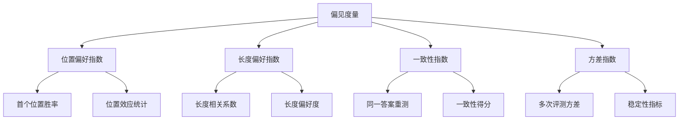
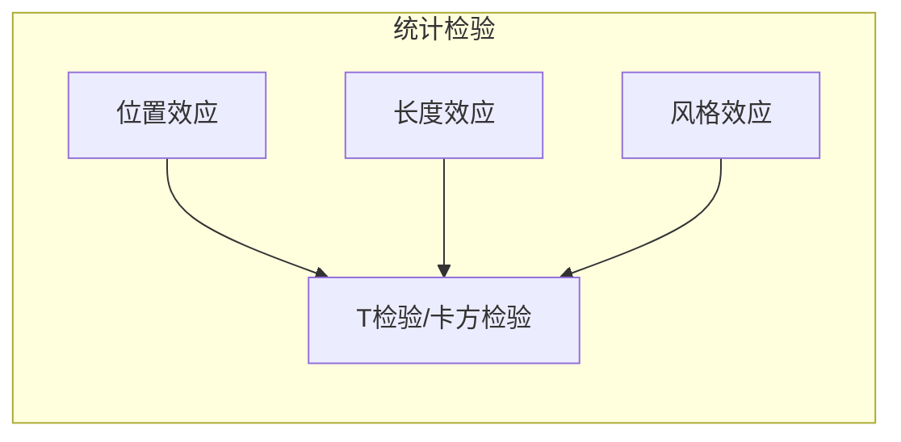

# 图7.17：偏见量化指标

## 偏见度量指标

```mermaid
flowchart TD
    A[偏见度量] --> B[位置偏好指数]
    A --> C[长度偏好指数]
    A --> D[一致性指数]
    A --> E[方差指数]
    
    B --> B1[首个位置胜率]
    B --> B2[位置效应统计]
    
    C --> C1[长度相关系数]
    C --> C2[长度偏好度]
    
    D --> D1[同一答案重测]
    D --> D2[一致性得分]
    
    E --> E1[多次评测方差]
    E --> E2[稳定性指标]
```

## 统计检验方法

```mermaid
flowchart LR
    subgraph 统计检验
        A[位置效应] --> D[T检验/卡方检验]
        B[长度效应] --> D
        C[风格效应] --> D
    end
```
