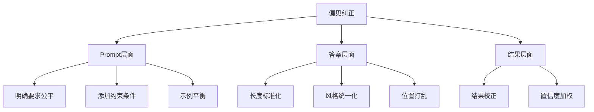
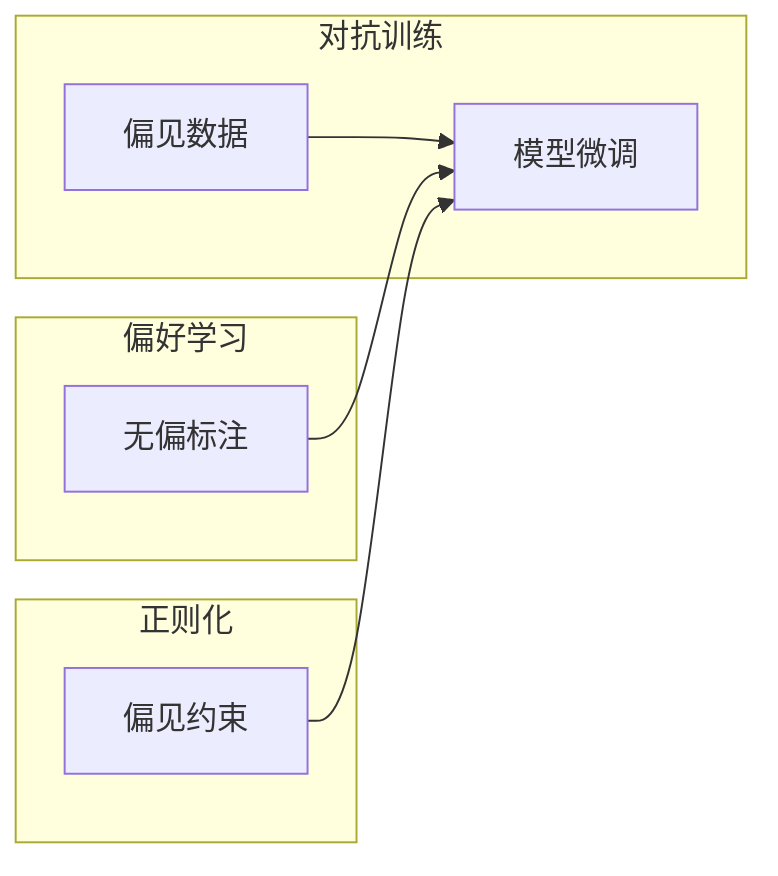

# 图7.18：偏见纠正策略

## 预问纠正方法

```mermaid
flowchart TD
    A[偏见纠正] --> B[Prompt层面]
    A --> C[答案层面]
    A --> D[结果层面]
    
    B --> B1[明确要求公平]
    B --> B2[添加约束条件]
    B --> B3[示例平衡]
    
    C --> C1[长度标准化]
    C --> C2[风格统一化]
    C --> C3[位置打乱]
    
    D --> D1[结果校正]
    D --> D2[置信度加权]
```

## 训练时纠正

```mermaid
flowchart LR
    subgraph 对抗训练
        A[偏见数据] --> D[模型微调]
    end
    
    subgraph 偏好学习
        B[无偏标注] --> D
    end
    
    subgraph 正则化
        C[偏见约束] --> D
    end
```
