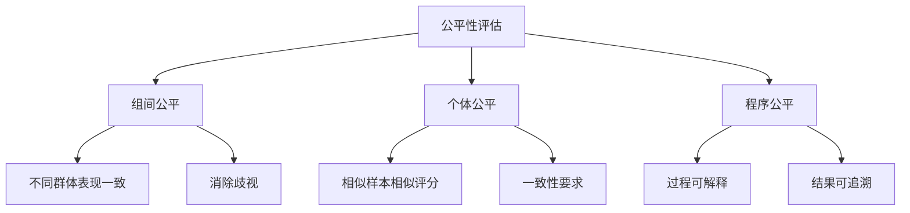
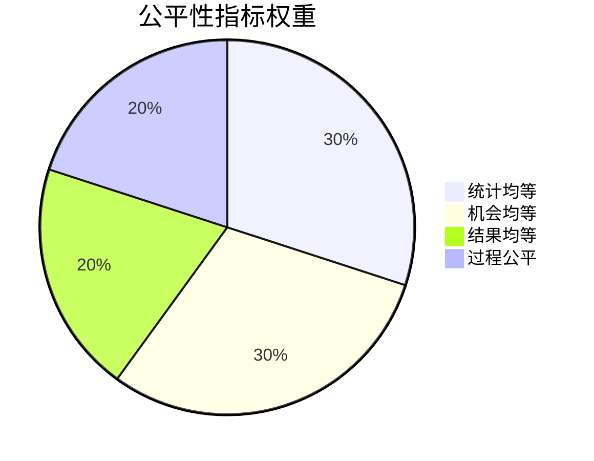

# 图7.19：公平性评估框架

## 公平性维度

```mermaid
flowchart TD
    A[公平性评估] --> B[组间公平]
    A --> C[个体公平]
    A --> D[程序公平]
    
    B --> B1[不同群体表现一致]
    B --> B2[消除歧视]
    
    C --> C1[相似样本相似评分]
    C --> C2[一致性要求]
    
    D --> D1[过程可解释]
    D --> D2[结果可追溯]
```

## 公平性指标

```mermaid
pie title 公平性指标权重
    "统计均等" : 30
    "机会均等" : 30
    "结果均等" : 20
    "过程公平" : 20
```
