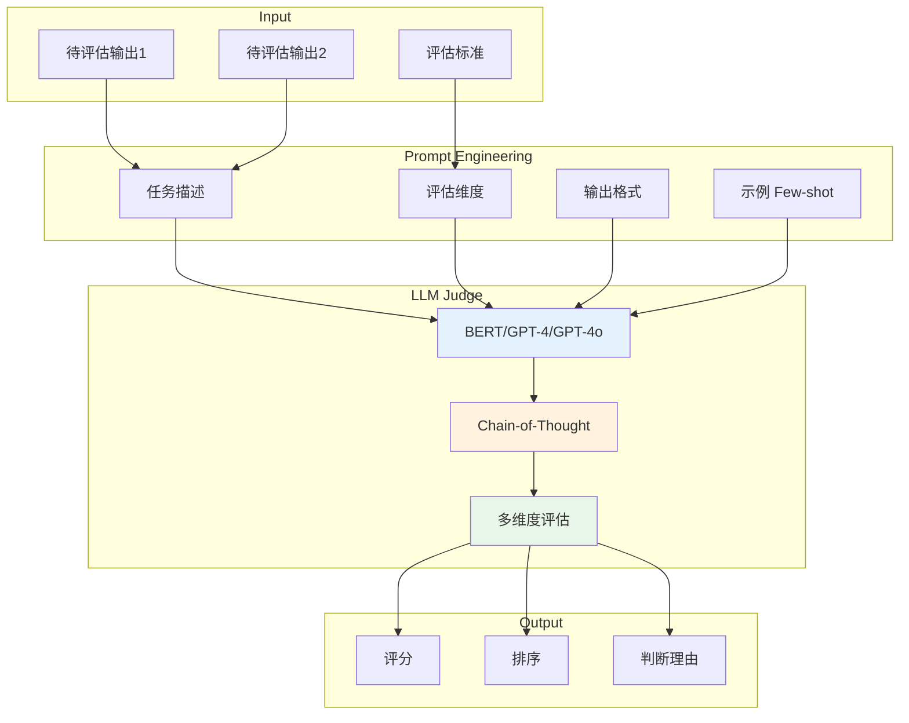

```mermaid
flowchart TB
    subgraph "Input"
        A[待评估输出1]
        B[待评估输出2]
        C[评估标准]
    end
    
    subgraph "Prompt Engineering"
        D[任务描述]
        E[评估维度]
        F[输出格式]
        G[示例 Few-shot]
    end
    
    subgraph "LLM Judge"
        H[BERT/GPT-4/GPT-4o]
        I[Chain-of-Thought]
        J[多维度评估]
    end
    
    subgraph "Output"
        K[评分]
        L[排序]
        M[判断理由]
    end
    
    A --> D
    B --> D
    C --> E
    D --> H
    E --> H
    F --> H
    G --> H
    H --> I
    I --> J
    J --> K
    J --> L
    J --> M
    
    style H fill:#e3f2fd
    style I fill:#fff3e0
    style J fill:#e8f5e9
```
