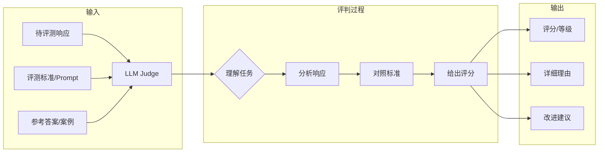
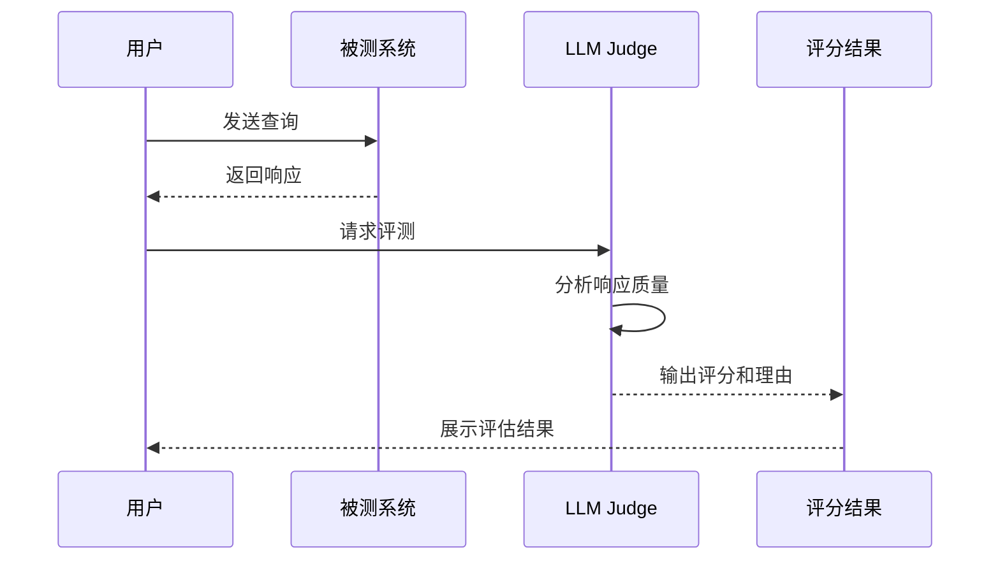
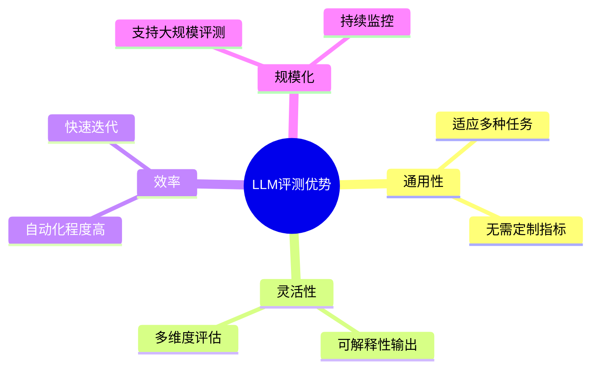

# 图7.1：LLM评测原理——基于大语言模型的自动化评估

## 核心理念

LLM-as-Judge 利用预训练大语言模型作为评判者，对其他AI系统的输出进行自动化质量评估。

```mermaid
flowchart LR
    subgraph 输入
        A[待评测响应] --> D[LLM Judge]
        B[评测标准/Prompt] --> D
        C[参考答案/案例] --> D
    end
    
    subgraph 评判过程
        D --> E{理解任务}
        E --> F[分析响应]
        F --> G[对照标准]
        G --> H[给出评分]
    end
    
    subgraph 输出
        H --> I[评分/等级]
        H --> J[详细理由]
        H --> K[改进建议]
    end
```

## 评估流程

```mermaid
sequenceDiagram
    participant U as 用户
    participant S as 被测系统
    participant J as LLM Judge
    participant R as 评分结果
    
    U->>S: 发送查询
    S-->>U: 返回响应
    
    U->>J: 请求评测
    J->>J: 分析响应质量
    J-->>R: 输出评分和理由
    
    R-->>U: 展示评估结果
```

## 优势

```mermaid
mindmap
  root((LLM评测优势))
    通用性
      适应多种任务
      无需定制指标
    灵活性
      可解释性输出
      多维度评估
    效率
      自动化程度高
      快速迭代
    规模化
      支持大规模评测
      持续监控
```
