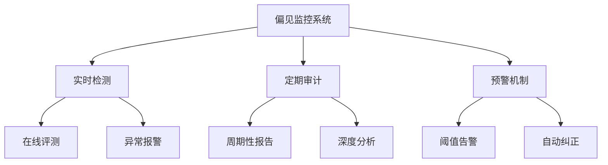
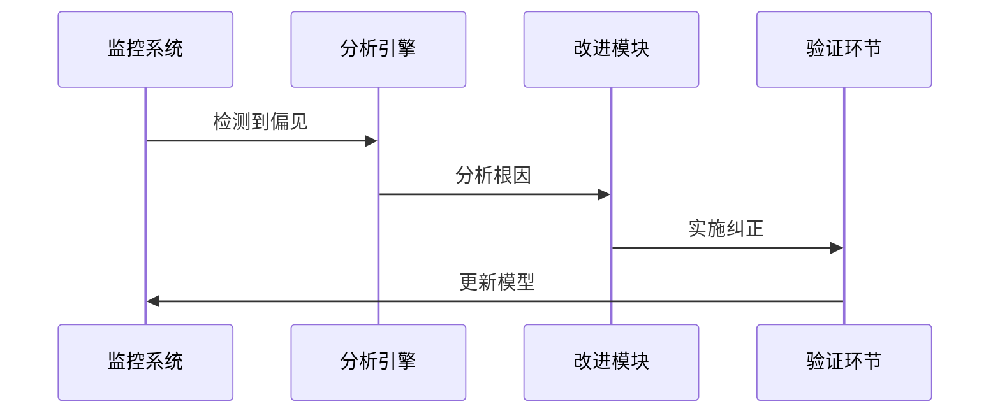

# 图7.20：偏见持续监控体系

## 监控架构

```mermaid
flowchart TD
    A[偏见监控系统] --> B[实时检测]
    A --> C[定期审计]
    A --> D[预警机制]
    
    B --> B1[在线评测]
    B --> B2[异常报警]
    
    C --> C1[周期性报告]
    C --> C2[深度分析]
    
    D --> D1[阈值告警]
    D --> D2[自动纠正]
```

## 持续改进流程

```mermaid
sequenceDiagram
    participant M as 监控系统
    participant A as 分析引擎
    participant I as 改进模块
    participant V as 验证环节
    
    M->>A: 检测到偏见
    A->>I: 分析根因
    I->>V: 实施纠正
    V->>M: 更新模型
```
