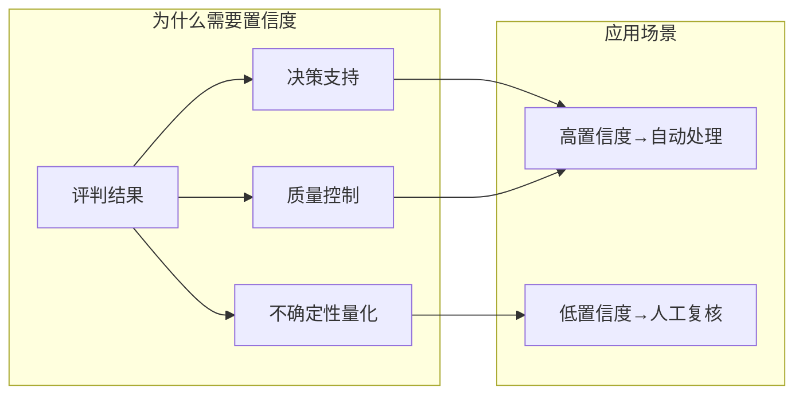
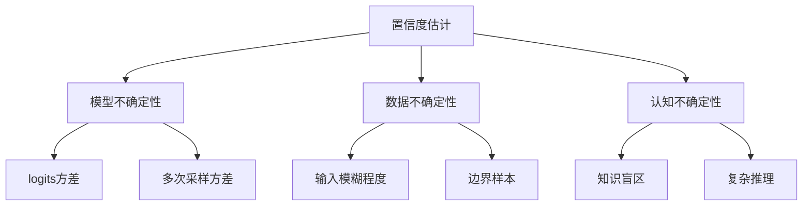

# 图7.21：置信度估计——评判结果可信度评估

## 置信度重要性

```mermaid
flowchart LR
    subgraph 为什么需要置信度
        A[评判结果] --> D[决策支持]
        A --> E[质量控制]
        A --> F[不确定性量化]
    end
    
    subgraph 应用场景
        D --> G[高置信度→自动处理]
        E --> G
        F --> H[低置信度→人工复核]
    end
```

## 置信度来源

```mermaid
flowchart TD
    A[置信度估计] --> B[模型不确定性]
    A --> C[数据不确定性]
    A --> D[认知不确定性]
    
    B --> B1[ logits方差]
    B --> B2[ 多次采样方差]
    
    C --> C1[输入模糊程度]
    C --> C2[边界样本]
    
    D --> D1[知识盲区]
    D --> D2[复杂推理]
```
