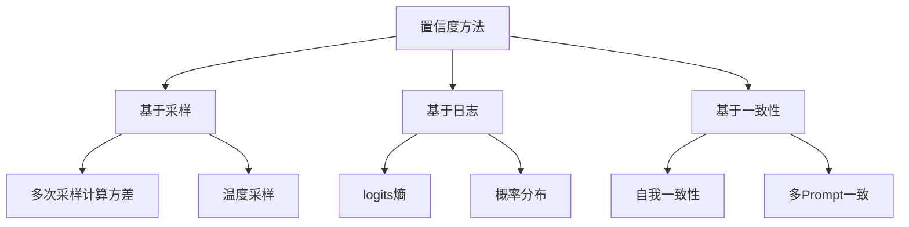
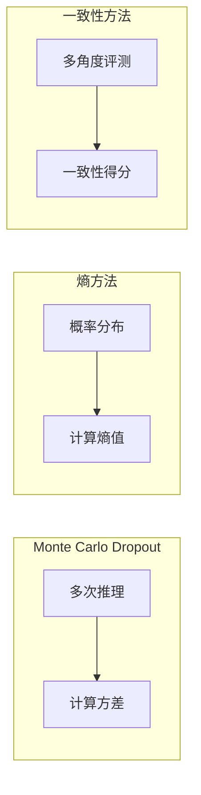

# 图7.22：置信度估计方法

## 估计方法分类

```mermaid
flowchart TD
    A[置信度方法] --> B[基于采样]
    A --> C[基于日志]
    A --> D[基于一致性]
    
    B --> B1[多次采样计算方差]
    B --> B2[温度采样]
    
    C --> C1[logits熵]
    C --> C2[概率分布]
    
    D --> D1[自我一致性]
    D --> D2[多Prompt一致]
```

## 实现方法

```mermaid
flowchart LR
    subgraph Monte Carlo Dropout
        A1[多次推理] --> A2[计算方差]
    end
    
    subgraph 熵方法
        B1[概率分布] --> B2[计算熵值]
    end
    
    subgraph 一致性方法
        C1[多角度评测] --> C2[一致性得分]
    end
```
