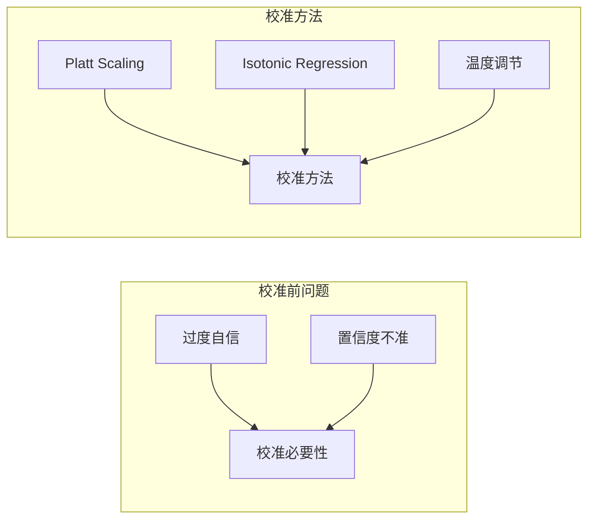
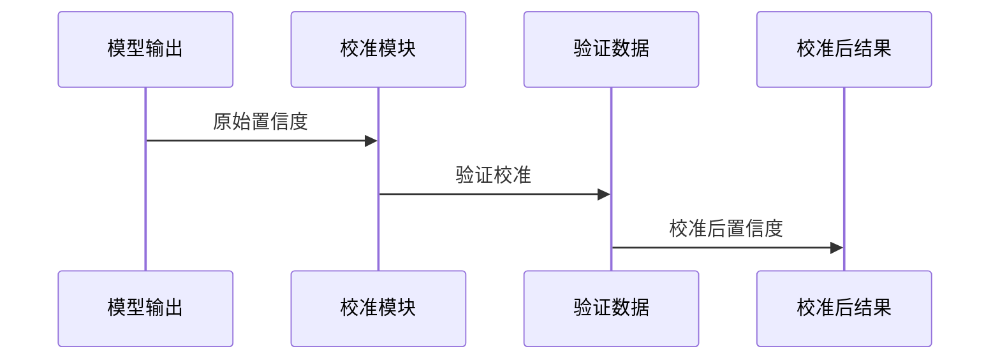

# 图7.23：置信度校准

## 校准必要性

```mermaid
flowchart LR
    subgraph 校准前问题
        A[过度自信] --> D[校准必要性]
        B[置信度不准] --> D
    end
    
    subgraph 校准方法
        C[Platt Scaling] --> E[校准方法]
        D1[Isotonic Regression] --> E
        D2[温度调节] --> E
    end
```

## 校准流程

```mermaid
sequenceDiagram
    participant M as 模型输出
    participant C as 校准模块
    participant V as 验证数据
    participant R as 校准后结果
    
    M->>C: 原始置信度
    C->>V: 验证校准
    V->>R: 校准后置信度
```
