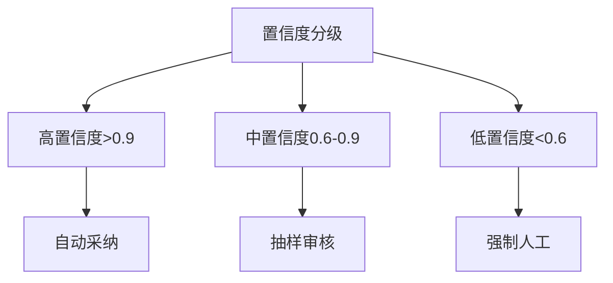
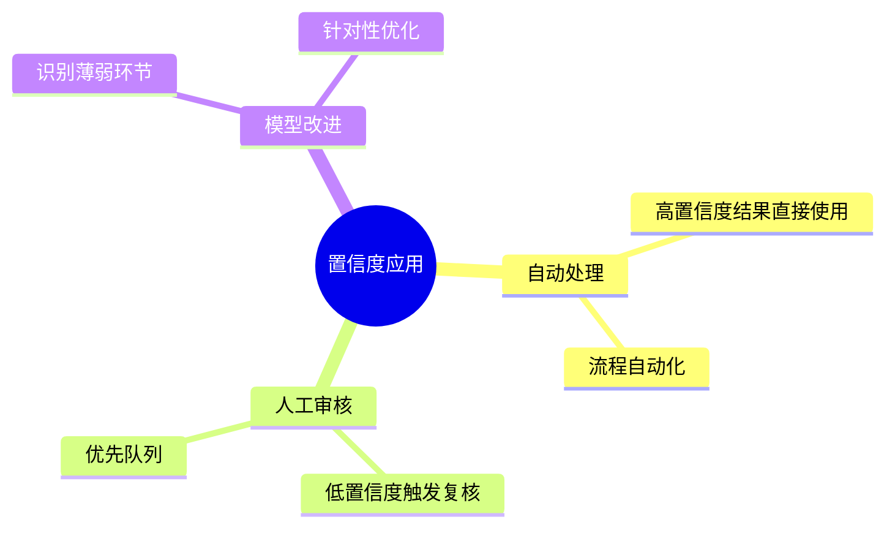

# 图7.24：置信度应用场景

## 分级处理策略

```mermaid
flowchart TD
    A[置信度分级] --> B[高置信度>0.9]
    A --> C[中置信度0.6-0.9]
    A --> D[低置信度<0.6]
    
    B --> B1[自动采纳]
    C --> C1[抽样审核]
    D --> D1[强制人工]
```

## 决策支持

```mermaid
mindmap
  root((置信度应用))
    自动处理
      高置信度结果直接使用
      流程自动化
    人工审核
      低置信度触发复核
      优先队列
    模型改进
      识别薄弱环节
      针对性优化
```
