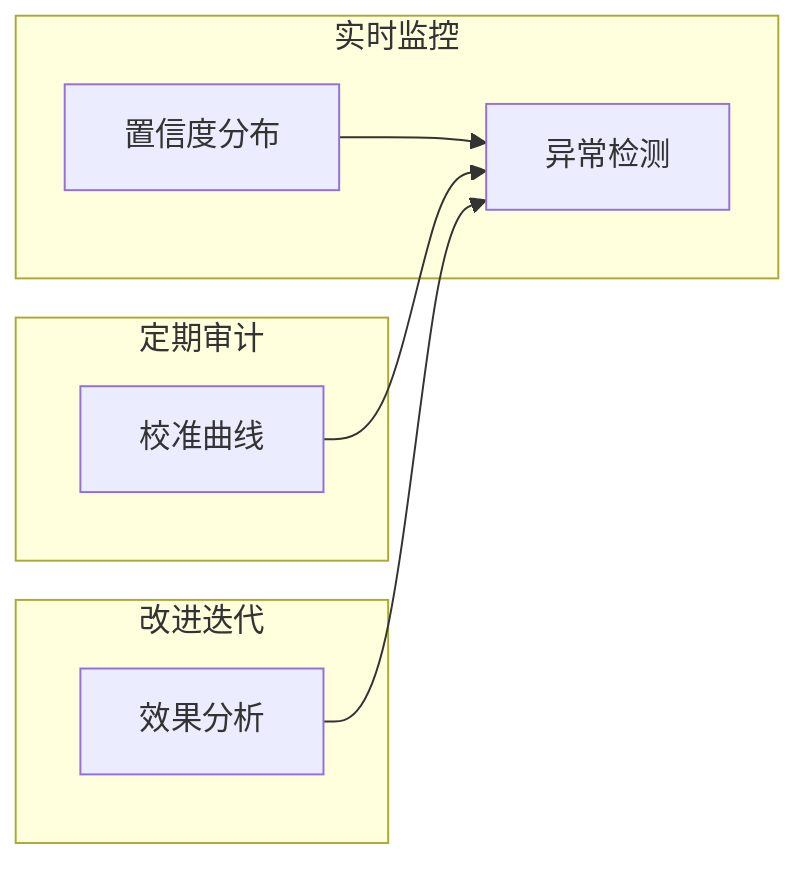

# 图7.25：置信度质量评估

## 评估指标

```mermaid
flowchart TD
   质量] --> B A[置信度[校准度]
    A --> C[区分度]
    A --> D[分辨率]
    
    B --> B1[预测概率vs实际准确率]
    B --> B2[ECE指标]
    
    C --> C1[高低分样本区分能力]
    C --> C2[AUC-Conf指标]
    
    D --> D1[置信度分布均匀性]
    D --> D2[信息量指标]
```

## 监控方法


