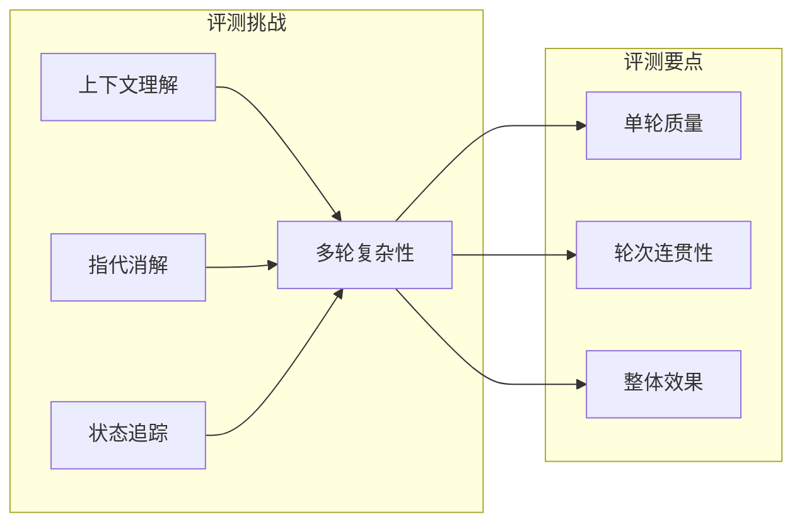
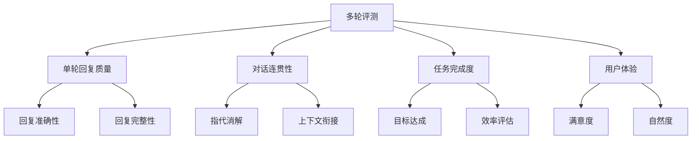

# 图7.26：多轮对话评测——上下文理解评估

## 多轮对话特点

```mermaid
flowchart LR
    subgraph 评测挑战
        A[上下文理解] --> D[多轮复杂性]
        B[指代消解] --> D
        C[状态追踪] --> D
    end
    
    subgraph 评测要点
        D --> E[单轮质量]
        D --> F[轮次连贯性]
        D --> G[整体效果]
    end
```

## 评测层次

```mermaid
flowchart TD
    A[多轮评测] --> B[单轮回复质量]
    A --> C[对话连贯性]
    A --> D[任务完成度]
    A --> E[用户体验]
    
    B --> B1[回复准确性]
    B --> B2[回复完整性]
    
    C --> C1[指代消解]
    C --> C2[上下文衔接]
    
    D --> D1[目标达成]
    D --> D2[效率评估]
    
    E --> E1[满意度]
    E --> E2[自然度]
```
