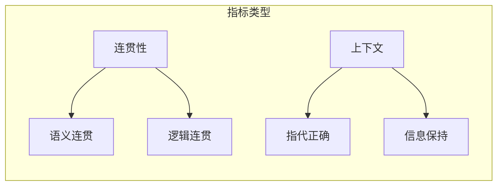

# 图7.27：对话流程评估

## 流程评估维度

```mermaid
flowchart TD
    A[对话流程] --> B[启动阶段]
    A --> C[进行阶段]
    A --> D[结束阶段]
    
   [理解 B --> B1用户意图]
    B --> B2[明确对话目标]
    
    C --> C1[保持上下文]
    C --> C2[适时澄清]
    C --> C3[引导对话]
    
    D --> D1[总结确认]
    D --> D2[礼貌结束]
```

## 评估指标


