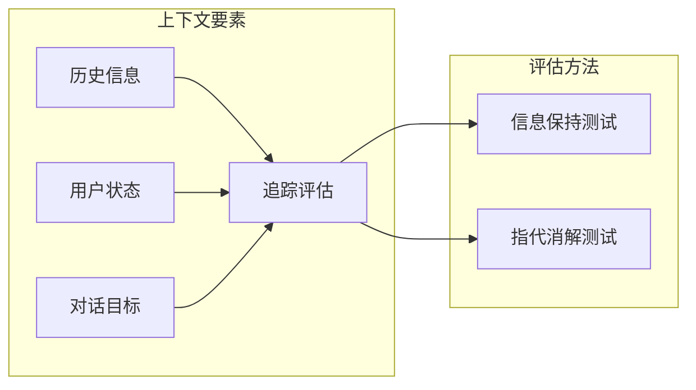
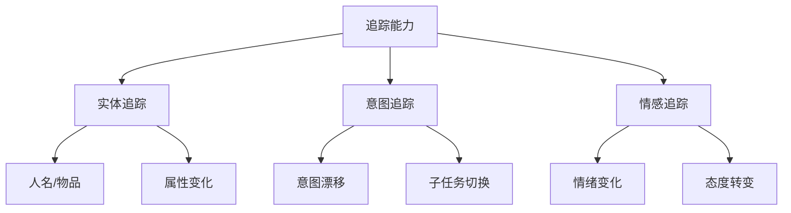

# 图7.28：上下文追踪评估

## 上下文理解评估

```mermaid
flowchart LR
    subgraph 上下文要素
        A[历史信息] --> D[追踪评估]
        B[用户状态] --> D
        C[对话目标] --> D
    end
    
    subgraph 评估方法
        D --> E[信息保持测试]
        D --> F[指代消解测试]
    end
```

## 追踪能力检测

```mermaid
flowchart TD
    A[追踪能力] --> B[实体追踪]
    A --> C[意图追踪]
    A --> D[情感追踪]
    
    B --> B1[人名/物品]
    B --> B2[属性变化]
    
    C --> C1[意图漂移]
    C --> C2[子任务切换]
    
    D --> D1[情绪变化]
    D --> D2[态度转变]
```
