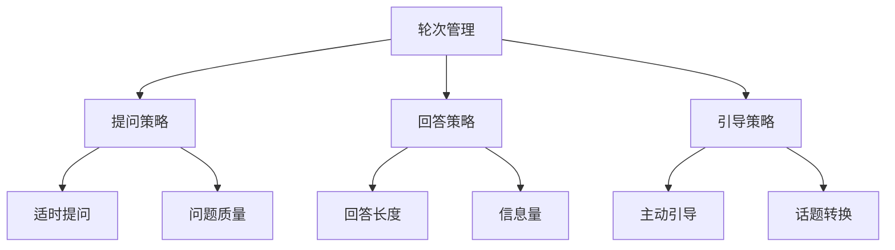
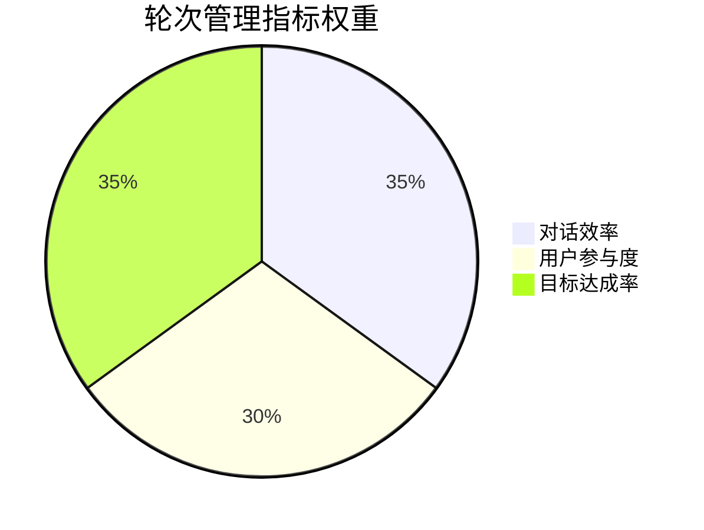

# 图7.29：对话轮次管理评估

## 轮次策略评估

```mermaid
flowchart TD
    A[轮次管理] --> B[提问策略]
    A --> C[回答策略]
    A --> D[引导策略]
    
    B --> B1[适时提问]
    B --> B2[问题质量]
    
    C --> C1[回答长度]
    C --> C2[信息量]
    
    D --> D1[主动引导]
    D --> D2[话题转换]
```

## 评估指标

```mermaid
pie title 轮次管理指标权重
    "对话效率" : 35
    "用户参与度" : 30
    "目标达成率" : 35
```
