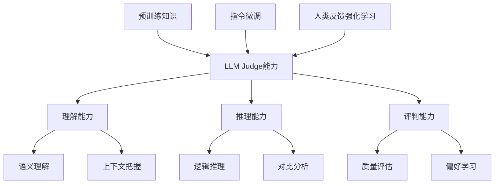
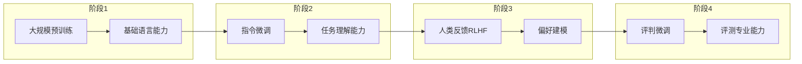
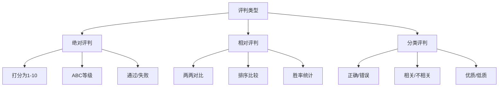

# 图7.2：LLM评测原理——评判能力来源与训练方法

## 能力来源

```mermaid
flowchart TD
    A[预训练知识] --> D[LLM Judge能力]
    B[指令微调] --> D
    C[人类反馈强化学习] --> D
    D --> E[理解能力]
    D --> F[推理能力]
    D --> G[评判能力]
    E --> I[语义理解]
    E --> J[上下文把握]
    F --> K[逻辑推理]
    F --> L[对比分析]
    G --> M[质量评估]
    G --> N[偏好学习]
```

## 训练范式

```mermaid
flowchart LR
    subgraph 阶段1
        A1[大规模预训练] --> B1[基础语言能力]
    end
    
    subgraph 阶段2
        B1 --> A2[指令微调]
        A2 --> B2[任务理解能力]
    end
    
    subgraph 阶段3
        B2 --> A3[人类反馈RLHF]
        A3 --> B3[偏好建模]
    end
    
    subgraph 阶段4
        B3 --> A4[评判微调]
        A4 --> B4[评测专业能力]
    end
```

## 评判类型

```mermaid
flowchart TB
    A[评判类型] --> B[绝对评判]
    A --> C[相对评判]
    A --> D[分类评判]
    
    B --> B1[打分为1-10]
    B --> B2[ABC等级]
    B --> B3[通过/失败]
    
    C --> C1[两两对比]
    C --> C2[排序比较]
    C --> C3[胜率统计]
    
    D --> D1[正确/错误]
    D --> D2[相关/不相关]
    D --> D3[优质/低质]
```
