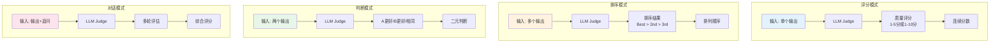

```mermaid
graph TD
    subgraph "评分模式"
        A[输入: 单个输出] --> B[LLM Judge]
        B --> C[质量评分<br/>1-5分或1-10分]
        C --> D[连续分数]
    end
    
    subgraph "排序模式"
        E[输入: 多个输出] --> F[LLM Judge]
        F --> G[排序结果<br/>Best > 2nd > 3rd]
        G --> H[排列顺序]
    end
    
    subgraph "判断模式"
        I[输入: 两个输出] --> J[LLM Judge]
        J --> K[A更好/B更好/相同]
        K --> L[二元判断]
    end
    
    subgraph "对话模式"
        M[输入: 输出+追问] --> N[LLM Judge]
        N --> O[多轮评估]
        O --> P[综合评分]
    end
    
    style A fill:#e3f2fd
    style E fill:#fff3e0
    style I fill:#e8f5e9
    style M fill:#fce4ec
```
