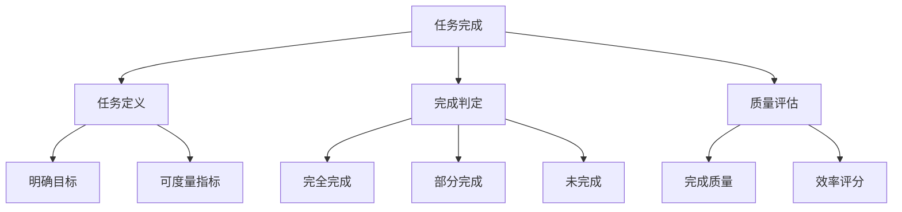
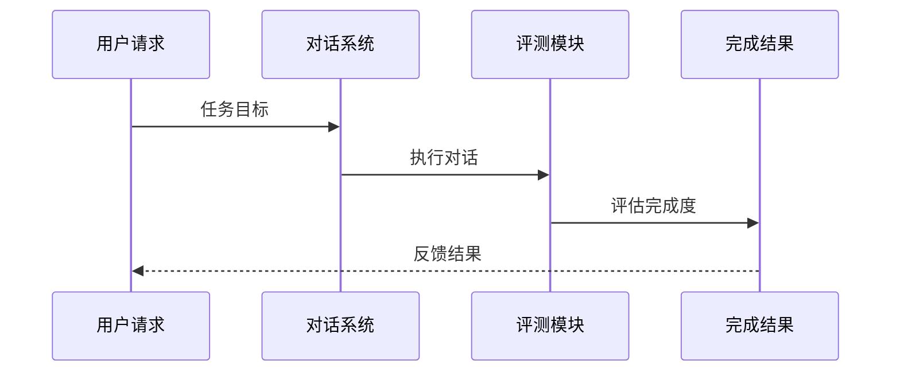

# 图7.30：任务完成率评估

## 任务完成评估框架

```mermaid
flowchart TD
    A[任务完成] --> B[任务定义]
    A --> C[完成判定]
    A --> D[质量评估]
    
    B --> B1[明确目标]
    B --> B2[可度量指标]
    
    C --> C1[完全完成]
    C --> C2[部分完成]
    C --> C3[未完成]
    
    D --> D1[完成质量]
    D --> D2[效率评分]
```

## 评估流程

```mermaid
sequenceDiagram
    participant U as 用户请求
    participant S as 对话系统
    participant E as 评测模块
    participant R as 完成结果
    
    U->>S: 任务目标
    S->>E: 执行对话
    E->>R: 评估完成度
    R-->>U: 反馈结果
```
