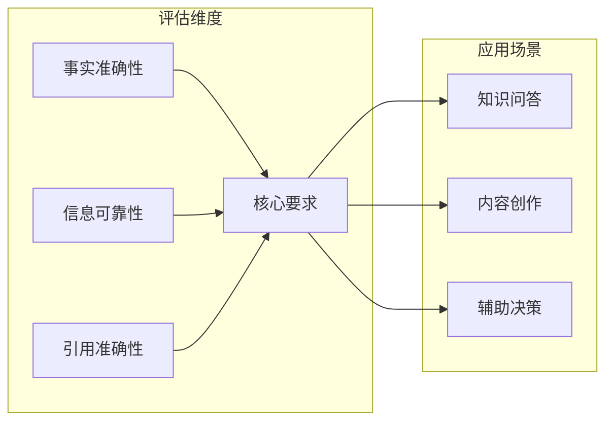
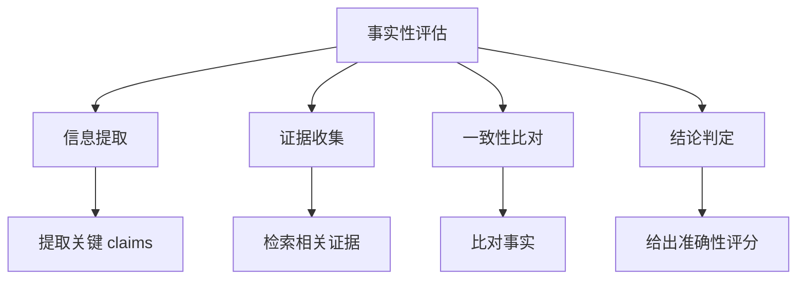

# 图7.31：事实性评估——准确性验证框架

## 事实性评估重要性

```mermaid
flowchart LR
    subgraph 评估维度
        A[事实准确性] --> D[核心要求]
        B[信息可靠性] --> D
        C[引用准确性] --> D
    end
    
    subgraph 应用场景
        D --> E[知识问答]
        D --> F[内容创作]
        D --> G[辅助决策]
    end
```

## 评估流程

```mermaid
flowchart TD
    A[事实性评估] --> B[信息提取]
    A --> C[证据收集]
    A --> D[一致性比对]
    A --> E[结论判定]
    
    B --> B1[提取关键 claims]
    C --> C1[检索相关证据]
    D --> D1[比对事实]
    E --> E1[给出准确性评分]
```
