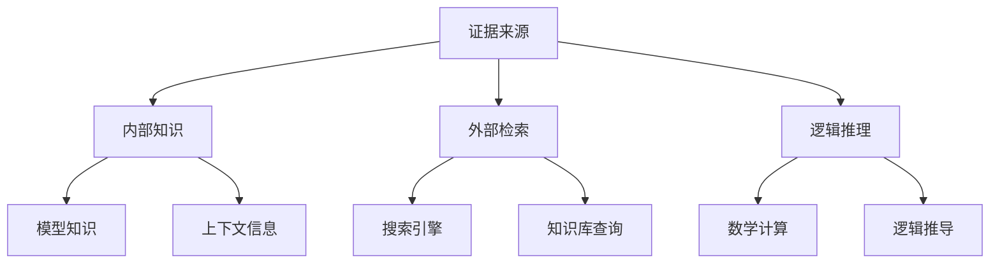
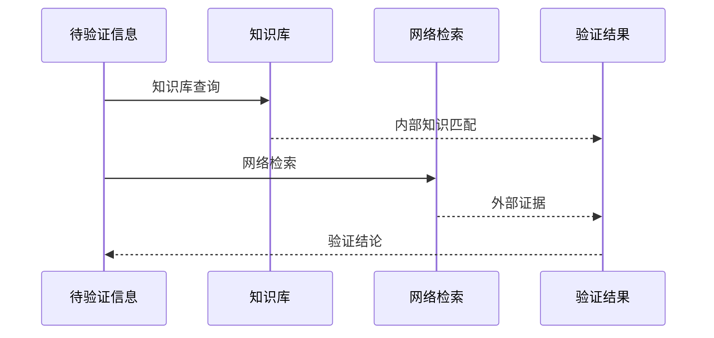

# 图7.32：证据验证方法

## 证据类型

```mermaid
flowchart TD
    A[证据来源] --> B[内部知识]
    A --> C[外部检索]
    A --> D[逻辑推理]
    
    B --> B1[模型知识]
    B --> B2[上下文信息]
    
    C --> C1[搜索引擎]
    C --> C2[知识库查询]
    
    D --> D1[数学计算]
    D --> D2[逻辑推导]
```

## 验证流程

```mermaid
sequenceDiagram
    participant R as 待验证信息
    participant K as 知识库
    participant W as 网络检索
    participant V as 验证结果
    
    R->>K: 知识库查询
    K-->>V: 内部知识匹配
    R->>W: 网络检索
    W-->>V: 外部证据
    V-->>R: 验证结论
```
