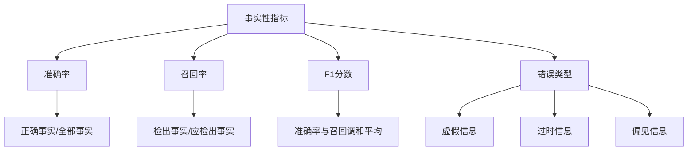

# 图7.33：事实性评估指标

## 评估指标

```mermaid
flowchart TD
    A[事实性指标] --> B[准确率]
    A --> C[召回率]
    A --> D[F1分数]
    A --> E[错误类型]
    
    B --> B1[正确事实/全部事实]
    C --> C1[检出事实/应检出事实]
    D --> D1[准确率与召回调和平均]
    
    E --> E1[虚假信息]
    E --> E2[过时信息]
    E --> E3[偏见信息]
```
