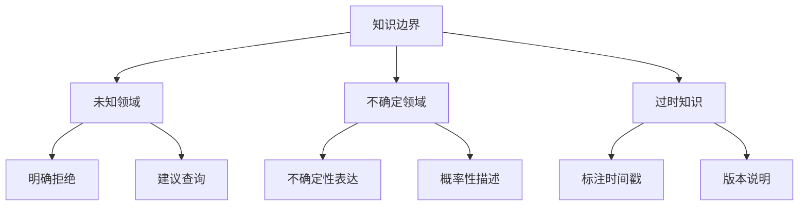
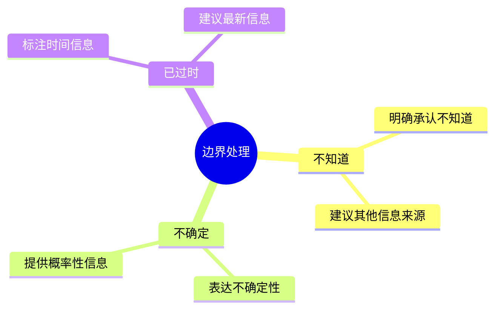

# 图7.34：知识边界识别

## 知识盲区检测

```mermaid
flowchart TD
    A[知识边界] --> B[未知领域]
    A --> C[不确定领域]
    A --> D[过时知识]
    
    B --> B1[明确拒绝]
    B --> B2[建议查询]
    
    C --> C1[不确定性表达]
    C --> C2[概率性描述]
    
    D --> D1[标注时间戳]
    D --> D2[版本说明]
```

## 边界处理策略

```mermaid
mindmap
  root((边界处理))
    不知道
      明确承认不知道
      建议其他信息来源
    不确定
      表达不确定性
      提供概率性信息
    已过时
      标注时间信息
      建议最新信息
```
