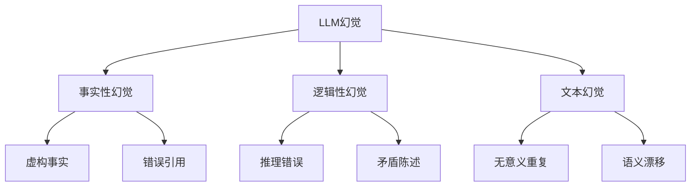
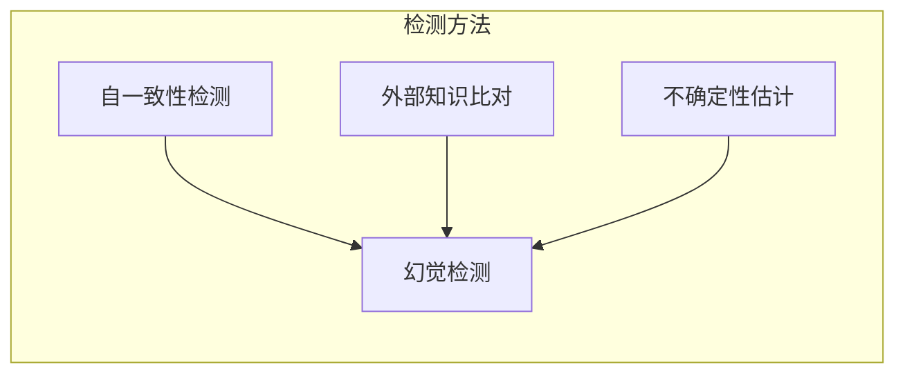

# 图7.35：幻觉检测与评估

## 幻觉类型

```mermaid
flowchart TD
    A[LLM幻觉] --> B[事实性幻觉]
    A --> C[逻辑性幻觉]
    A --> D[文本幻觉]
    
    B --> B1[虚构事实]
    B --> B2[错误引用]
    
    C --> C1[推理错误]
    C --> C2[矛盾陈述]
    
    D --> D1[无意义重复]
    D --> D2[语义漂移]
```

## 检测方法

```mermaid
flowchart LR
    subgraph 检测方法
        A[自一致性检测] --> D[幻觉检测]
        B[外部知识比对] --> D
        C[不确定性估计] --> D
    end
```
