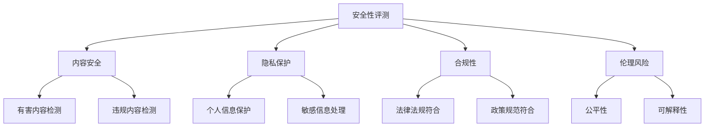

# 图7.36：安全性评测——风险识别与评估

## 安全评测维度

```mermaid
flowchart TD
    A[安全性评测] --> B[内容安全]
    A --> C[隐私保护]
    A --> D[合规性]
    A --> E[伦理风险]
    
    B --> B1[有害内容检测]
    B --> B2[违规内容检测]
    
    C --> C1[个人信息保护]
    C --> C2[敏感信息处理]
    
    D --> D1[法律法规符合]
    D --> D2[政策规范符合]
    
    E --> E1[公平性]
    E --> E2[可解释性]
```
